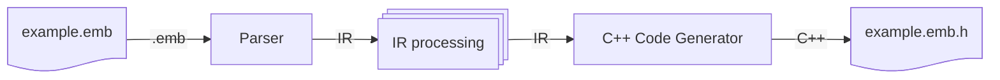
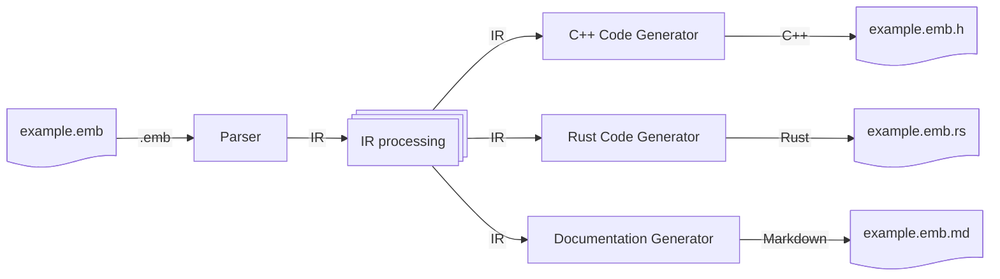

# Design of the Emboss Tool

This document describes the internals of Emboss.  End users do not need to read
this document.

## Overall Design

The Emboss compiler follows a reasonably standard compiler design, where the
input source text is first converted to an *intermediate representation* (IR),
then various operations are performed on the IR, and finally the IR is used to
construct the final output — at the time of writing, C++ source code:



Currently, Emboss is split into two programs: the *front end*, which parses the
input and does almost all of the IR processing, and the *C++ back end*, which
does a minimal amount of C++-specific IR processing and generates the final C++
code.  This split makes it straightforward to add new back ends later:




### IR

Most of the Emboss compiler operates on a data structure known as an *IR*, or
intermediate representation.  The Emboss IR is a tree, with node types defined
in [compiler/util/ir_data.py][ir_data_py].

[ir_data_py]: ../compiler/util/ir_data.py

The first stage of the compiler — the parser — generates an "initial" IR, which
only contains information that is directly available in the source tree.  Even
without any further information, the initial IR can be quite large even for a
very short `.emb` file.  For example, this `.emb`:

```emb
# Copyright 2019 Google LLC

-- This is a simple, real-world example structure.

[$default byte_order: "LittleEndian"]
[(cpp) namespace: "emboss::test"]


struct LogFileStatus:
  0  [+4]   UInt        file_state
  4  [+12]  UInt:8[12]  file_name
  16 [+4]   UInt        file_size_kb
  20 [+4]   UInt        media
```

turns into this IR immediately after parsing:

```mermaid
graph TD
    n0@{ shape: diamond, label: "module" }
    n1@{ shape: diamond, label: "attributes" }
    n0 --> n1
    n0 --> n6
    n0 --> n59
    n0 --> n61
    n0 --> l34
    n1 --> n2
    n1 --> n4
    n2@{ shape: diamond, label: "attribute" }
    n2 --> l0
    n2 --> n3
    n2 --> l2
    n3@{ shape: diamond, label: "value" }
    n3 --> l1
    n4@{ shape: diamond, label: "attribute" }
    n4 --> l3
    n4 --> n5
    n4 --> l5
    n4 --> l6
    n5@{ shape: diamond, label: "value" }
    n5 --> l4
    n6@{ shape: diamond, label: "types" }
    n6 --> n7
    n7@{ shape: diamond, label: "type" }
    n7 --> n8
    n7 --> l29
    n7 --> n58
    n8@{ shape: diamond, label: "structure" }
    n8 --> n9
    n9@{ shape: diamond, label: "fields" }
    n9 --> n10
    n9 --> n21
    n9 --> n36
    n9 --> n47
    n10@{ shape: diamond, label: "field" }
    n10 --> n11
    n10 --> n14
    n10 --> n19
    n10 --> n20
    n11@{ shape: diamond, label: "location" }
    n11 --> n12
    n11 --> n13
    n12@{ shape: diamond, label: "start" }
    n12 --> l7
    n13@{ shape: diamond, label: "size" }
    n13 --> l8
    n14@{ shape: diamond, label: "type" }
    n14 --> n15
    n15@{ shape: diamond, label: "atomic_type" }
    n15 --> n16
    n16@{ shape: diamond, label: "reference" }
    n16 --> n17
    n17@{ shape: diamond, label: "source_names" }
    n17 --> n18
    n18@{ shape: diamond, label: "source_name" }
    n18 --> l9
    n19@{ shape: diamond, label: "name" }
    n19 --> l10
    n20@{ shape: diamond, label: "existence_condition" }
    n20 --> l11
    n21@{ shape: diamond, label: "field" }
    n21 --> n22
    n21 --> n25
    n21 --> n34
    n21 --> n35
    n22@{ shape: diamond, label: "location" }
    n22 --> n23
    n22 --> n24
    n23@{ shape: diamond, label: "start" }
    n23 --> l12
    n24@{ shape: diamond, label: "size" }
    n24 --> l13
    n25@{ shape: diamond, label: "type" }
    n25 --> n26
    n26@{ shape: diamond, label: "array_type" }
    n26 --> n27
    n26 --> n33
    n27@{ shape: diamond, label: "base_type" }
    n27 --> n28
    n27 --> n32
    n28@{ shape: diamond, label: "atomic_type" }
    n28 --> n29
    n29@{ shape: diamond, label: "reference" }
    n29 --> n30
    n30@{ shape: diamond, label: "source_names" }
    n30 --> n31
    n31@{ shape: diamond, label: "source_name" }
    n31 --> l14
    n32@{ shape: diamond, label: "size_in_bits" }
    n32 --> l15
    n33@{ shape: diamond, label: "element_count" }
    n33 --> l16
    n34@{ shape: diamond, label: "name" }
    n34 --> l17
    n35@{ shape: diamond, label: "existence_condition" }
    n35 --> l18
    n36@{ shape: diamond, label: "field" }
    n36 --> n37
    n36 --> n40
    n36 --> n45
    n36 --> n46
    n37@{ shape: diamond, label: "location" }
    n37 --> n38
    n37 --> n39
    n38@{ shape: diamond, label: "start" }
    n38 --> l19
    n39@{ shape: diamond, label: "size" }
    n39 --> l20
    n40@{ shape: diamond, label: "type" }
    n40 --> n41
    n41@{ shape: diamond, label: "atomic_type" }
    n41 --> n42
    n42@{ shape: diamond, label: "reference" }
    n42 --> n43
    n43@{ shape: diamond, label: "source_names" }
    n43 --> n44
    n44@{ shape: diamond, label: "source_name" }
    n44 --> l21
    n45@{ shape: diamond, label: "name" }
    n45 --> l22
    n46@{ shape: diamond, label: "existence_condition" }
    n46 --> l23
    n47@{ shape: diamond, label: "field" }
    n47 --> n48
    n47 --> n51
    n47 --> n56
    n47 --> n57
    n48@{ shape: diamond, label: "location" }
    n48 --> n49
    n48 --> n50
    n49@{ shape: diamond, label: "start" }
    n49 --> l24
    n50@{ shape: diamond, label: "size" }
    n50 --> l25
    n51@{ shape: diamond, label: "type" }
    n51 --> n52
    n52@{ shape: diamond, label: "atomic_type" }
    n52 --> n53
    n53@{ shape: diamond, label: "reference" }
    n53 --> n54
    n54@{ shape: diamond, label: "source_names" }
    n54 --> n55
    n55@{ shape: diamond, label: "source_name" }
    n55 --> l26
    n56@{ shape: diamond, label: "name" }
    n56 --> l27
    n57@{ shape: diamond, label: "existence_condition" }
    n57 --> l28
    n58@{ shape: diamond, label: "name" }
    n58 --> l30
    n59@{ shape: diamond, label: "documentations" }
    n59 --> n60
    n60@{ shape: diamond, label: "documentation" }
    n60 --> l31
    n61@{ shape: diamond, label: "foreign_imports" }
    n61 --> n62
    n62@{ shape: diamond, label: "foreign_import" }
    n62 --> l32
    n62 --> l33
    l0@{ shape: rect, label: "name: byte_order" }
    l1@{ shape: rect, label: "string_constant: LittleEndian" }
    l2@{ shape: rect, label: "is_default: True" }
    l3@{ shape: rect, label: "name: namespace" }
    l4@{ shape: rect, label: "string_constant: emboss::test" }
    l5@{ shape: rect, label: "is_default: False" }
    l6@{ shape: rect, label: "back_end: cpp" }
    l7@{ shape: rect, label: "constant: 0" }
    l8@{ shape: rect, label: "constant: 4" }
    l9@{ shape: rect, label: "text: UInt" }
    l10@{ shape: rect, label: "name: file_state" }
    l11@{ shape: rect, label: "boolean_constant: True" }
    l12@{ shape: rect, label: "constant: 4" }
    l13@{ shape: rect, label: "constant: 12" }
    l14@{ shape: rect, label: "text: UInt" }
    l15@{ shape: rect, label: "constant: 8" }
    l16@{ shape: rect, label: "constant: 12" }
    l17@{ shape: rect, label: "name: file_name" }
    l18@{ shape: rect, label: "boolean_constant: True" }
    l19@{ shape: rect, label: "constant: 16" }
    l20@{ shape: rect, label: "constant: 4" }
    l21@{ shape: rect, label: "text: UInt" }
    l22@{ shape: rect, label: "name: file_size_kb" }
    l23@{ shape: rect, label: "boolean_constant: True" }
    l24@{ shape: rect, label: "constant: 20" }
    l25@{ shape: rect, label: "constant: 4" }
    l26@{ shape: rect, label: "text: UInt" }
    l27@{ shape: rect, label: "name: media" }
    l28@{ shape: rect, label: "boolean_constant: True" }
    l29@{ shape: rect, label: "addressable_unit: 8" }
    l30@{ shape: rect, label: "name: LogFileStatus" }
    l31@{ shape: rect, label: "text: This is a simple, re" }
    l32@{ shape: rect, label: "file_name: " }
    l33@{ shape: rect, label: "local_name: " }
    l34@{ shape: rect, label: "source_text: # Copyright 2019 Goo" }
```



This initial IR then goes through a series of *elaborations*, which annotate
the IR, and *validations*, which check various properties of the IR.  In many
cases, elaborations and validations are mixed together — for example, in the
symbol resolution stage, names in the IR (`field`) are *elaborated* with the
absolute symbol to which they resolve (`module.Type.field`), and, at the same
time, the symbol resolver *validates* that every name resolves to exactly one
absolute symbol.  At the end of this process, the IR is much larger:

```emb
  0  [+4]   UInt        file_state
```

```mermaid
graph TD
    n0@{ shape: diamond, label: "module" }
  n0 --> n1
  n0 --> n8
  n0 --> n278
  n0 --> n280
  n0 --> l313
  n0 --> l314
    n1@{ shape: diamond, label: "attributes" }
  n1 --> n2
  n1 --> n4
  n1 --> n6
    n2@{ shape: diamond, label: "attribute" }
  n2 --> l0
  n2 --> n3
  n2 --> l2
    n3@{ shape: diamond, label: "value" }
  n3 --> l1
    n4@{ shape: diamond, label: "attribute" }
  n4 --> l3
  n4 --> n5
  n4 --> l5
  n4 --> l6
    n5@{ shape: diamond, label: "value" }
  n5 --> l4
    n6@{ shape: diamond, label: "attribute" }
  n6 --> l7
  n6 --> n7
    n7@{ shape: diamond, label: "value" }
  n7 --> l8
    n8@{ shape: diamond, label: "types" }
  n8 --> n9
    n9@{ shape: diamond, label: "type" }
  n9 --> n10
  n9 --> n269
  n9 --> n272
  n9 --> l309
    n10@{ shape: diamond, label: "structure" }
  n10 --> n11
  n10 --> n268
    n11@{ shape: diamond, label: "fields" }
  n11 --> n12
  n11 --> n36
  n11 --> n68
  n11 --> n92
  n11 --> n116
  n11 --> n218
  n11 --> n243
    n12@{ shape: diamond, label: "field" }
  n12 --> n13
  n12 --> n20
  n12 --> n27
  n12 --> n28
  n12 --> n31
  n12 --> n34
    n13@{ shape: diamond, label: "location" }
  n13 --> n14
  n13 --> n17
    n14@{ shape: diamond, label: "start" }
  n14 --> l9
  n14 --> n15
    n15@{ shape: diamond, label: "type" }
  n15 --> n16
    n16@{ shape: diamond, label: "integer" }
  n16 --> l10
  n16 --> l11
  n16 --> l12
  n16 --> l13
    n17@{ shape: diamond, label: "size" }
  n17 --> l14
  n17 --> n18
    n18@{ shape: diamond, label: "type" }
  n18 --> n19
    n19@{ shape: diamond, label: "integer" }
  n19 --> l15
  n19 --> l16
  n19 --> l17
  n19 --> l18
    n20@{ shape: diamond, label: "type" }
  n20 --> n21
    n21@{ shape: diamond, label: "atomic_type" }
  n21 --> n22
    n22@{ shape: diamond, label: "reference" }
  n22 --> n23
  n22 --> n25
    n23@{ shape: diamond, label: "canonical_name" }
  n23 --> l19
  n23 --> n24
    n24@{ shape: diamond, label: "object_paths" }
  n24 --> l20
    n25@{ shape: diamond, label: "source_names" }
  n25 --> n26
    n26@{ shape: diamond, label: "source_name" }
  n26 --> l21
    n27@{ shape: diamond, label: "write_method" }
  n27 --> l22
    n28@{ shape: diamond, label: "name" }
  n28 --> l23
  n28 --> n29
    n29@{ shape: diamond, label: "canonical_name" }
  n29 --> l24
  n29 --> n30
    n30@{ shape: diamond, label: "object_paths" }
  n30 --> l25
  n30 --> l26
    n31@{ shape: diamond, label: "attributes" }
  n31 --> n32
    n32@{ shape: diamond, label: "attribute" }
  n32 --> l27
  n32 --> n33
  n32 --> l29
    n33@{ shape: diamond, label: "value" }
  n33 --> l28
    n34@{ shape: diamond, label: "existence_condition" }
  n34 --> l30
  n34 --> n35
    n35@{ shape: diamond, label: "type" }
  n35 --> l31
    n36@{ shape: diamond, label: "field" }
  n36 --> n37
  n36 --> n44
  n36 --> n59
  n36 --> n60
  n36 --> n63
  n36 --> n66
    n37@{ shape: diamond, label: "location" }
  n37 --> n38
  n37 --> n41
    n38@{ shape: diamond, label: "start" }
  n38 --> l32
  n38 --> n39
    n39@{ shape: diamond, label: "type" }
  n39 --> n40
    n40@{ shape: diamond, label: "integer" }
  n40 --> l33
  n40 --> l34
  n40 --> l35
  n40 --> l36
    n41@{ shape: diamond, label: "size" }
  n41 --> l37
  n41 --> n42
    n42@{ shape: diamond, label: "type" }
  n42 --> n43
    n43@{ shape: diamond, label: "integer" }
  n43 --> l38
  n43 --> l39
  n43 --> l40
  n43 --> l41
    n44@{ shape: diamond, label: "type" }
  n44 --> n45
    n45@{ shape: diamond, label: "array_type" }
  n45 --> n46
  n45 --> n56
    n46@{ shape: diamond, label: "base_type" }
  n46 --> n47
  n46 --> n53
    n47@{ shape: diamond, label: "atomic_type" }
  n47 --> n48
    n48@{ shape: diamond, label: "reference" }
  n48 --> n49
  n48 --> n51
    n49@{ shape: diamond, label: "canonical_name" }
  n49 --> l42
  n49 --> n50
    n50@{ shape: diamond, label: "object_paths" }
  n50 --> l43
    n51@{ shape: diamond, label: "source_names" }
  n51 --> n52
    n52@{ shape: diamond, label: "source_name" }
  n52 --> l44
    n53@{ shape: diamond, label: "size_in_bits" }
  n53 --> l45
  n53 --> n54
    n54@{ shape: diamond, label: "type" }
  n54 --> n55
    n55@{ shape: diamond, label: "integer" }
  n55 --> l46
  n55 --> l47
  n55 --> l48
  n55 --> l49
    n56@{ shape: diamond, label: "element_count" }
  n56 --> l50
  n56 --> n57
    n57@{ shape: diamond, label: "type" }
  n57 --> n58
    n58@{ shape: diamond, label: "integer" }
  n58 --> l51
  n58 --> l52
  n58 --> l53
  n58 --> l54
    n59@{ shape: diamond, label: "write_method" }
  n59 --> l55
    n60@{ shape: diamond, label: "name" }
  n60 --> l56
  n60 --> n61
    n61@{ shape: diamond, label: "canonical_name" }
  n61 --> l57
  n61 --> n62
    n62@{ shape: diamond, label: "object_paths" }
  n62 --> l58
  n62 --> l59
    n63@{ shape: diamond, label: "attributes" }
  n63 --> n64
    n64@{ shape: diamond, label: "attribute" }
  n64 --> l60
  n64 --> n65
  n64 --> l62
    n65@{ shape: diamond, label: "value" }
  n65 --> l61
    n66@{ shape: diamond, label: "existence_condition" }
  n66 --> l63
  n66 --> n67
    n67@{ shape: diamond, label: "type" }
  n67 --> l64
    n68@{ shape: diamond, label: "field" }
  n68 --> n69
  n68 --> n76
  n68 --> n83
  n68 --> n84
  n68 --> n87
  n68 --> n90
    n69@{ shape: diamond, label: "location" }
  n69 --> n70
  n69 --> n73
    n70@{ shape: diamond, label: "start" }
  n70 --> l65
  n70 --> n71
    n71@{ shape: diamond, label: "type" }
  n71 --> n72
    n72@{ shape: diamond, label: "integer" }
  n72 --> l66
  n72 --> l67
  n72 --> l68
  n72 --> l69
    n73@{ shape: diamond, label: "size" }
  n73 --> l70
  n73 --> n74
    n74@{ shape: diamond, label: "type" }
  n74 --> n75
    n75@{ shape: diamond, label: "integer" }
  n75 --> l71
  n75 --> l72
  n75 --> l73
  n75 --> l74
    n76@{ shape: diamond, label: "type" }
  n76 --> n77
    n77@{ shape: diamond, label: "atomic_type" }
  n77 --> n78
    n78@{ shape: diamond, label: "reference" }
  n78 --> n79
  n78 --> n81
    n79@{ shape: diamond, label: "canonical_name" }
  n79 --> l75
  n79 --> n80
    n80@{ shape: diamond, label: "object_paths" }
  n80 --> l76
    n81@{ shape: diamond, label: "source_names" }
  n81 --> n82
    n82@{ shape: diamond, label: "source_name" }
  n82 --> l77
    n83@{ shape: diamond, label: "write_method" }
  n83 --> l78
    n84@{ shape: diamond, label: "name" }
  n84 --> l79
  n84 --> n85
    n85@{ shape: diamond, label: "canonical_name" }
  n85 --> l80
  n85 --> n86
    n86@{ shape: diamond, label: "object_paths" }
  n86 --> l81
  n86 --> l82
    n87@{ shape: diamond, label: "attributes" }
  n87 --> n88
    n88@{ shape: diamond, label: "attribute" }
  n88 --> l83
  n88 --> n89
  n88 --> l85
    n89@{ shape: diamond, label: "value" }
  n89 --> l84
    n90@{ shape: diamond, label: "existence_condition" }
  n90 --> l86
  n90 --> n91
    n91@{ shape: diamond, label: "type" }
  n91 --> l87
    n92@{ shape: diamond, label: "field" }
  n92 --> n93
  n92 --> n100
  n92 --> n107
  n92 --> n108
  n92 --> n111
  n92 --> n114
    n93@{ shape: diamond, label: "location" }
  n93 --> n94
  n93 --> n97
    n94@{ shape: diamond, label: "start" }
  n94 --> l88
  n94 --> n95
    n95@{ shape: diamond, label: "type" }
  n95 --> n96
    n96@{ shape: diamond, label: "integer" }
  n96 --> l89
  n96 --> l90
  n96 --> l91
  n96 --> l92
    n97@{ shape: diamond, label: "size" }
  n97 --> l93
  n97 --> n98
    n98@{ shape: diamond, label: "type" }
  n98 --> n99
    n99@{ shape: diamond, label: "integer" }
  n99 --> l94
  n99 --> l95
  n99 --> l96
  n99 --> l97
    n100@{ shape: diamond, label: "type" }
  n100 --> n101
    n101@{ shape: diamond, label: "atomic_type" }
  n101 --> n102
    n102@{ shape: diamond, label: "reference" }
  n102 --> n103
  n102 --> n105
    n103@{ shape: diamond, label: "canonical_name" }
  n103 --> l98
  n103 --> n104
    n104@{ shape: diamond, label: "object_paths" }
  n104 --> l99
    n105@{ shape: diamond, label: "source_names" }
  n105 --> n106
    n106@{ shape: diamond, label: "source_name" }
  n106 --> l100
    n107@{ shape: diamond, label: "write_method" }
  n107 --> l101
    n108@{ shape: diamond, label: "name" }
  n108 --> l102
  n108 --> n109
    n109@{ shape: diamond, label: "canonical_name" }
  n109 --> l103
  n109 --> n110
    n110@{ shape: diamond, label: "object_paths" }
  n110 --> l104
  n110 --> l105
    n111@{ shape: diamond, label: "attributes" }
  n111 --> n112
    n112@{ shape: diamond, label: "attribute" }
  n112 --> l106
  n112 --> n113
  n112 --> l108
    n113@{ shape: diamond, label: "value" }
  n113 --> l107
    n114@{ shape: diamond, label: "existence_condition" }
  n114 --> l109
  n114 --> n115
    n115@{ shape: diamond, label: "type" }
  n115 --> l110
    n116@{ shape: diamond, label: "field" }
  n116 --> n117
  n116 --> n209
  n116 --> n210
  n116 --> n213
  n116 --> n216
    n117@{ shape: diamond, label: "read_transform" }
  n117 --> n118
  n117 --> n207
    n118@{ shape: diamond, label: "function" }
  n118 --> l111
  n118 --> n119
  n118 --> l233
    n119@{ shape: diamond, label: "argss" }
  n119 --> n120
  n119 --> n123
  n119 --> n144
  n119 --> n165
  n119 --> n186
    n120@{ shape: diamond, label: "args" }
  n120 --> l112
  n120 --> n121
    n121@{ shape: diamond, label: "type" }
  n121 --> n122
    n122@{ shape: diamond, label: "integer" }
  n122 --> l113
  n122 --> l114
  n122 --> l115
  n122 --> l116
    n123@{ shape: diamond, label: "args" }
  n123 --> n124
  n123 --> n142
    n124@{ shape: diamond, label: "function" }
  n124 --> l117
  n124 --> n125
  n124 --> l141
    n125@{ shape: diamond, label: "argss" }
  n125 --> n126
  n125 --> n128
  n125 --> n139
    n126@{ shape: diamond, label: "args" }
  n126 --> l118
  n126 --> n127
    n127@{ shape: diamond, label: "type" }
  n127 --> l119
    n128@{ shape: diamond, label: "args" }
  n128 --> n129
  n128 --> n137
    n129@{ shape: diamond, label: "function" }
  n129 --> l120
  n129 --> n130
  n129 --> l131
    n130@{ shape: diamond, label: "argss" }
  n130 --> n131
  n130 --> n134
    n131@{ shape: diamond, label: "args" }
  n131 --> l121
  n131 --> n132
    n132@{ shape: diamond, label: "type" }
  n132 --> n133
    n133@{ shape: diamond, label: "integer" }
  n133 --> l122
  n133 --> l123
  n133 --> l124
  n133 --> l125
    n134@{ shape: diamond, label: "args" }
  n134 --> l126
  n134 --> n135
    n135@{ shape: diamond, label: "type" }
  n135 --> n136
    n136@{ shape: diamond, label: "integer" }
  n136 --> l127
  n136 --> l128
  n136 --> l129
  n136 --> l130
    n137@{ shape: diamond, label: "type" }
  n137 --> n138
    n138@{ shape: diamond, label: "integer" }
  n138 --> l132
  n138 --> l133
  n138 --> l134
  n138 --> l135
    n139@{ shape: diamond, label: "args" }
  n139 --> l136
  n139 --> n140
    n140@{ shape: diamond, label: "type" }
  n140 --> n141
    n141@{ shape: diamond, label: "integer" }
  n141 --> l137
  n141 --> l138
  n141 --> l139
  n141 --> l140
    n142@{ shape: diamond, label: "type" }
  n142 --> n143
    n143@{ shape: diamond, label: "integer" }
  n143 --> l142
  n143 --> l143
  n143 --> l144
  n143 --> l145
    n144@{ shape: diamond, label: "args" }
  n144 --> n145
  n144 --> n163
    n145@{ shape: diamond, label: "function" }
  n145 --> l146
  n145 --> n146
  n145 --> l170
    n146@{ shape: diamond, label: "argss" }
  n146 --> n147
  n146 --> n149
  n146 --> n160
    n147@{ shape: diamond, label: "args" }
  n147 --> l147
  n147 --> n148
    n148@{ shape: diamond, label: "type" }
  n148 --> l148
    n149@{ shape: diamond, label: "args" }
  n149 --> n150
  n149 --> n158
    n150@{ shape: diamond, label: "function" }
  n150 --> l149
  n150 --> n151
  n150 --> l160
    n151@{ shape: diamond, label: "argss" }
  n151 --> n152
  n151 --> n155
    n152@{ shape: diamond, label: "args" }
  n152 --> l150
  n152 --> n153
    n153@{ shape: diamond, label: "type" }
  n153 --> n154
    n154@{ shape: diamond, label: "integer" }
  n154 --> l151
  n154 --> l152
  n154 --> l153
  n154 --> l154
    n155@{ shape: diamond, label: "args" }
  n155 --> l155
  n155 --> n156
    n156@{ shape: diamond, label: "type" }
  n156 --> n157
    n157@{ shape: diamond, label: "integer" }
  n157 --> l156
  n157 --> l157
  n157 --> l158
  n157 --> l159
    n158@{ shape: diamond, label: "type" }
  n158 --> n159
    n159@{ shape: diamond, label: "integer" }
  n159 --> l161
  n159 --> l162
  n159 --> l163
  n159 --> l164
    n160@{ shape: diamond, label: "args" }
  n160 --> l165
  n160 --> n161
    n161@{ shape: diamond, label: "type" }
  n161 --> n162
    n162@{ shape: diamond, label: "integer" }
  n162 --> l166
  n162 --> l167
  n162 --> l168
  n162 --> l169
    n163@{ shape: diamond, label: "type" }
  n163 --> n164
    n164@{ shape: diamond, label: "integer" }
  n164 --> l171
  n164 --> l172
  n164 --> l173
  n164 --> l174
    n165@{ shape: diamond, label: "args" }
  n165 --> n166
  n165 --> n184
    n166@{ shape: diamond, label: "function" }
  n166 --> l175
  n166 --> n167
  n166 --> l199
    n167@{ shape: diamond, label: "argss" }
  n167 --> n168
  n167 --> n170
  n167 --> n181
    n168@{ shape: diamond, label: "args" }
  n168 --> l176
  n168 --> n169
    n169@{ shape: diamond, label: "type" }
  n169 --> l177
    n170@{ shape: diamond, label: "args" }
  n170 --> n171
  n170 --> n179
    n171@{ shape: diamond, label: "function" }
  n171 --> l178
  n171 --> n172
  n171 --> l189
    n172@{ shape: diamond, label: "argss" }
  n172 --> n173
  n172 --> n176
    n173@{ shape: diamond, label: "args" }
  n173 --> l179
  n173 --> n174
    n174@{ shape: diamond, label: "type" }
  n174 --> n175
    n175@{ shape: diamond, label: "integer" }
  n175 --> l180
  n175 --> l181
  n175 --> l182
  n175 --> l183
    n176@{ shape: diamond, label: "args" }
  n176 --> l184
  n176 --> n177
    n177@{ shape: diamond, label: "type" }
  n177 --> n178
    n178@{ shape: diamond, label: "integer" }
  n178 --> l185
  n178 --> l186
  n178 --> l187
  n178 --> l188
    n179@{ shape: diamond, label: "type" }
  n179 --> n180
    n180@{ shape: diamond, label: "integer" }
  n180 --> l190
  n180 --> l191
  n180 --> l192
  n180 --> l193
    n181@{ shape: diamond, label: "args" }
  n181 --> l194
  n181 --> n182
    n182@{ shape: diamond, label: "type" }
  n182 --> n183
    n183@{ shape: diamond, label: "integer" }
  n183 --> l195
  n183 --> l196
  n183 --> l197
  n183 --> l198
    n184@{ shape: diamond, label: "type" }
  n184 --> n185
    n185@{ shape: diamond, label: "integer" }
  n185 --> l200
  n185 --> l201
  n185 --> l202
  n185 --> l203
    n186@{ shape: diamond, label: "args" }
  n186 --> n187
  n186 --> n205
    n187@{ shape: diamond, label: "function" }
  n187 --> l204
  n187 --> n188
  n187 --> l228
    n188@{ shape: diamond, label: "argss" }
  n188 --> n189
  n188 --> n191
  n188 --> n202
    n189@{ shape: diamond, label: "args" }
  n189 --> l205
  n189 --> n190
    n190@{ shape: diamond, label: "type" }
  n190 --> l206
    n191@{ shape: diamond, label: "args" }
  n191 --> n192
  n191 --> n200
    n192@{ shape: diamond, label: "function" }
  n192 --> l207
  n192 --> n193
  n192 --> l218
    n193@{ shape: diamond, label: "argss" }
  n193 --> n194
  n193 --> n197
    n194@{ shape: diamond, label: "args" }
  n194 --> l208
  n194 --> n195
    n195@{ shape: diamond, label: "type" }
  n195 --> n196
    n196@{ shape: diamond, label: "integer" }
  n196 --> l209
  n196 --> l210
  n196 --> l211
  n196 --> l212
    n197@{ shape: diamond, label: "args" }
  n197 --> l213
  n197 --> n198
    n198@{ shape: diamond, label: "type" }
  n198 --> n199
    n199@{ shape: diamond, label: "integer" }
  n199 --> l214
  n199 --> l215
  n199 --> l216
  n199 --> l217
    n200@{ shape: diamond, label: "type" }
  n200 --> n201
    n201@{ shape: diamond, label: "integer" }
  n201 --> l219
  n201 --> l220
  n201 --> l221
  n201 --> l222
    n202@{ shape: diamond, label: "args" }
  n202 --> l223
  n202 --> n203
    n203@{ shape: diamond, label: "type" }
  n203 --> n204
    n204@{ shape: diamond, label: "integer" }
  n204 --> l224
  n204 --> l225
  n204 --> l226
  n204 --> l227
    n205@{ shape: diamond, label: "type" }
  n205 --> n206
    n206@{ shape: diamond, label: "integer" }
  n206 --> l229
  n206 --> l230
  n206 --> l231
  n206 --> l232
    n207@{ shape: diamond, label: "type" }
  n207 --> n208
    n208@{ shape: diamond, label: "integer" }
  n208 --> l234
  n208 --> l235
  n208 --> l236
  n208 --> l237
    n209@{ shape: diamond, label: "write_method" }
  n209 --> l238
    n210@{ shape: diamond, label: "name" }
  n210 --> l239
  n210 --> n211
    n211@{ shape: diamond, label: "canonical_name" }
  n211 --> l240
  n211 --> n212
    n212@{ shape: diamond, label: "object_paths" }
  n212 --> l241
  n212 --> l242
    n213@{ shape: diamond, label: "attributes" }
  n213 --> n214
    n214@{ shape: diamond, label: "attribute" }
  n214 --> l243
  n214 --> n215
    n215@{ shape: diamond, label: "value" }
  n215 --> l244
    n216@{ shape: diamond, label: "existence_condition" }
  n216 --> l245
  n216 --> n217
    n217@{ shape: diamond, label: "type" }
  n217 --> l246
    n218@{ shape: diamond, label: "field" }
  n218 --> n219
  n218 --> n234
  n218 --> n235
  n218 --> n238
  n218 --> n241
    n219@{ shape: diamond, label: "read_transform" }
  n219 --> n220
  n219 --> n232
    n220@{ shape: diamond, label: "function" }
  n220 --> l247
  n220 --> n221
  n220 --> l256
    n221@{ shape: diamond, label: "argss" }
  n221 --> n222
    n222@{ shape: diamond, label: "args" }
  n222 --> n223
  n222 --> n230
    n223@{ shape: diamond, label: "field_reference" }
  n223 --> n224
    n224@{ shape: diamond, label: "paths" }
  n224 --> n225
    n225@{ shape: diamond, label: "path" }
  n225 --> n226
  n225 --> n228
    n226@{ shape: diamond, label: "canonical_name" }
  n226 --> l248
  n226 --> n227
    n227@{ shape: diamond, label: "object_paths" }
  n227 --> l249
  n227 --> l250
    n228@{ shape: diamond, label: "source_names" }
  n228 --> n229
    n229@{ shape: diamond, label: "source_name" }
  n229 --> l251
    n230@{ shape: diamond, label: "type" }
  n230 --> n231
    n231@{ shape: diamond, label: "integer" }
  n231 --> l252
  n231 --> l253
  n231 --> l254
  n231 --> l255
    n232@{ shape: diamond, label: "type" }
  n232 --> n233
    n233@{ shape: diamond, label: "integer" }
  n233 --> l257
  n233 --> l258
  n233 --> l259
  n233 --> l260
    n234@{ shape: diamond, label: "write_method" }
  n234 --> l261
    n235@{ shape: diamond, label: "name" }
  n235 --> l262
  n235 --> n236
    n236@{ shape: diamond, label: "canonical_name" }
  n236 --> l263
  n236 --> n237
    n237@{ shape: diamond, label: "object_paths" }
  n237 --> l264
  n237 --> l265
    n238@{ shape: diamond, label: "attributes" }
  n238 --> n239
    n239@{ shape: diamond, label: "attribute" }
  n239 --> l266
  n239 --> n240
    n240@{ shape: diamond, label: "value" }
  n240 --> l267
    n241@{ shape: diamond, label: "existence_condition" }
  n241 --> l268
  n241 --> n242
    n242@{ shape: diamond, label: "type" }
  n242 --> l269
    n243@{ shape: diamond, label: "field" }
  n243 --> n244
  n243 --> n259
  n243 --> n260
  n243 --> n263
  n243 --> n266
    n244@{ shape: diamond, label: "read_transform" }
  n244 --> n245
  n244 --> n257
    n245@{ shape: diamond, label: "function" }
  n245 --> l270
  n245 --> n246
  n245 --> l279
    n246@{ shape: diamond, label: "argss" }
  n246 --> n247
    n247@{ shape: diamond, label: "args" }
  n247 --> n248
  n247 --> n255
    n248@{ shape: diamond, label: "field_reference" }
  n248 --> n249
    n249@{ shape: diamond, label: "paths" }
  n249 --> n250
    n250@{ shape: diamond, label: "path" }
  n250 --> n251
  n250 --> n253
    n251@{ shape: diamond, label: "canonical_name" }
  n251 --> l271
  n251 --> n252
    n252@{ shape: diamond, label: "object_paths" }
  n252 --> l272
  n252 --> l273
    n253@{ shape: diamond, label: "source_names" }
  n253 --> n254
    n254@{ shape: diamond, label: "source_name" }
  n254 --> l274
    n255@{ shape: diamond, label: "type" }
  n255 --> n256
    n256@{ shape: diamond, label: "integer" }
  n256 --> l275
  n256 --> l276
  n256 --> l277
  n256 --> l278
    n257@{ shape: diamond, label: "type" }
  n257 --> n258
    n258@{ shape: diamond, label: "integer" }
  n258 --> l280
  n258 --> l281
  n258 --> l282
  n258 --> l283
    n259@{ shape: diamond, label: "write_method" }
  n259 --> l284
    n260@{ shape: diamond, label: "name" }
  n260 --> l285
  n260 --> n261
    n261@{ shape: diamond, label: "canonical_name" }
  n261 --> l286
  n261 --> n262
    n262@{ shape: diamond, label: "object_paths" }
  n262 --> l287
  n262 --> l288
    n263@{ shape: diamond, label: "attributes" }
  n263 --> n264
    n264@{ shape: diamond, label: "attribute" }
  n264 --> l289
  n264 --> n265
    n265@{ shape: diamond, label: "value" }
  n265 --> l290
    n266@{ shape: diamond, label: "existence_condition" }
  n266 --> l291
  n266 --> n267
    n267@{ shape: diamond, label: "type" }
  n267 --> l292
    n268@{ shape: diamond, label: "fields_in_dependency_orders" }
  n268 --> l293
  n268 --> l294
  n268 --> l295
  n268 --> l296
  n268 --> l297
  n268 --> l298
  n268 --> l299
    n269@{ shape: diamond, label: "name" }
  n269 --> l300
  n269 --> n270
    n270@{ shape: diamond, label: "canonical_name" }
  n270 --> l301
  n270 --> n271
    n271@{ shape: diamond, label: "object_paths" }
  n271 --> l302
    n272@{ shape: diamond, label: "attributes" }
  n272 --> n273
    n273@{ shape: diamond, label: "attribute" }
  n273 --> l303
  n273 --> n274
    n274@{ shape: diamond, label: "value" }
  n274 --> n275
    n275@{ shape: diamond, label: "expression" }
  n275 --> l304
  n275 --> n276
    n276@{ shape: diamond, label: "type" }
  n276 --> n277
    n277@{ shape: diamond, label: "integer" }
  n277 --> l305
  n277 --> l306
  n277 --> l307
  n277 --> l308
    n278@{ shape: diamond, label: "documentations" }
  n278 --> n279
    n279@{ shape: diamond, label: "documentation" }
  n279 --> l310
    n280@{ shape: diamond, label: "foreign_imports" }
  n280 --> n281
    n281@{ shape: diamond, label: "foreign_import" }
  n281 --> l311
  n281 --> l312
    l0@{ shape: rect, label: "name: byte_order" }
    l1@{ shape: rect, label: "string_constant: LittleEndian" }
    l2@{ shape: rect, label: "is_default: True" }
    l3@{ shape: rect, label: "name: namespace" }
    l4@{ shape: rect, label: "string_constant: emboss::test" }
    l5@{ shape: rect, label: "back_end: cpp" }
    l6@{ shape: rect, label: "is_default: False" }
    l7@{ shape: rect, label: "name: expected_back_ends" }
    l8@{ shape: rect, label: "string_constant: cpp" }
    l9@{ shape: rect, label: "constant: 0" }
    l10@{ shape: rect, label: "modulus: infinity" }
    l11@{ shape: rect, label: "modular_value: 0" }
    l12@{ shape: rect, label: "minimum_value: 0" }
    l13@{ shape: rect, label: "maximum_value: 0" }
    l14@{ shape: rect, label: "constant: 4" }
    l15@{ shape: rect, label: "modulus: infinity" }
    l16@{ shape: rect, label: "modular_value: 4" }
    l17@{ shape: rect, label: "minimum_value: 4" }
    l18@{ shape: rect, label: "maximum_value: 4" }
    l19@{ shape: rect, label: "module_file: " }
    l20@{ shape: rect, label: "object_path: UInt" }
    l21@{ shape: rect, label: "text: UInt" }
    l22@{ shape: rect, label: "physical: True" }
    l23@{ shape: rect, label: "name: file_state" }
    l24@{ shape: rect, label: "module_file: testdata/golden/span" }
    l25@{ shape: rect, label: "object_path: LogFileStatus" }
    l26@{ shape: rect, label: "object_path: file_state" }
    l27@{ shape: rect, label: "name: byte_order" }
    l28@{ shape: rect, label: "string_constant: LittleEndian" }
    l29@{ shape: rect, label: "is_default: False" }
    l30@{ shape: rect, label: "boolean_constant: True" }
    l31@{ shape: rect, label: "boolean: True" }
    l32@{ shape: rect, label: "constant: 4" }
    l33@{ shape: rect, label: "modulus: infinity" }
    l34@{ shape: rect, label: "modular_value: 4" }
    l35@{ shape: rect, label: "minimum_value: 4" }
    l36@{ shape: rect, label: "maximum_value: 4" }
    l37@{ shape: rect, label: "constant: 12" }
    l38@{ shape: rect, label: "modulus: infinity" }
    l39@{ shape: rect, label: "modular_value: 12" }
    l40@{ shape: rect, label: "minimum_value: 12" }
    l41@{ shape: rect, label: "maximum_value: 12" }
    l42@{ shape: rect, label: "module_file: " }
    l43@{ shape: rect, label: "object_path: UInt" }
    l44@{ shape: rect, label: "text: UInt" }
    l45@{ shape: rect, label: "constant: 8" }
    l46@{ shape: rect, label: "modulus: infinity" }
    l47@{ shape: rect, label: "modular_value: 8" }
    l48@{ shape: rect, label: "minimum_value: 8" }
    l49@{ shape: rect, label: "maximum_value: 8" }
    l50@{ shape: rect, label: "constant: 12" }
    l51@{ shape: rect, label: "modulus: infinity" }
    l52@{ shape: rect, label: "modular_value: 12" }
    l53@{ shape: rect, label: "minimum_value: 12" }
    l54@{ shape: rect, label: "maximum_value: 12" }
    l55@{ shape: rect, label: "physical: True" }
    l56@{ shape: rect, label: "name: file_name" }
    l57@{ shape: rect, label: "module_file: testdata/golden/span" }
    l58@{ shape: rect, label: "object_path: LogFileStatus" }
    l59@{ shape: rect, label: "object_path: file_name" }
    l60@{ shape: rect, label: "name: byte_order" }
    l61@{ shape: rect, label: "string_constant: LittleEndian" }
    l62@{ shape: rect, label: "is_default: False" }
    l63@{ shape: rect, label: "boolean_constant: True" }
    l64@{ shape: rect, label: "boolean: True" }
    l65@{ shape: rect, label: "constant: 16" }
    l66@{ shape: rect, label: "modulus: infinity" }
    l67@{ shape: rect, label: "modular_value: 16" }
    l68@{ shape: rect, label: "minimum_value: 16" }
    l69@{ shape: rect, label: "maximum_value: 16" }
    l70@{ shape: rect, label: "constant: 4" }
    l71@{ shape: rect, label: "modulus: infinity" }
    l72@{ shape: rect, label: "modular_value: 4" }
    l73@{ shape: rect, label: "minimum_value: 4" }
    l74@{ shape: rect, label: "maximum_value: 4" }
    l75@{ shape: rect, label: "module_file: " }
    l76@{ shape: rect, label: "object_path: UInt" }
    l77@{ shape: rect, label: "text: UInt" }
    l78@{ shape: rect, label: "physical: True" }
    l79@{ shape: rect, label: "name: file_size_kb" }
    l80@{ shape: rect, label: "module_file: testdata/golden/span" }
    l81@{ shape: rect, label: "object_path: LogFileStatus" }
    l82@{ shape: rect, label: "object_path: file_size_kb" }
    l83@{ shape: rect, label: "name: byte_order" }
    l84@{ shape: rect, label: "string_constant: LittleEndian" }
    l85@{ shape: rect, label: "is_default: False" }
    l86@{ shape: rect, label: "boolean_constant: True" }
    l87@{ shape: rect, label: "boolean: True" }
    l88@{ shape: rect, label: "constant: 20" }
    l89@{ shape: rect, label: "modulus: infinity" }
    l90@{ shape: rect, label: "modular_value: 20" }
    l91@{ shape: rect, label: "minimum_value: 20" }
    l92@{ shape: rect, label: "maximum_value: 20" }
    l93@{ shape: rect, label: "constant: 4" }
    l94@{ shape: rect, label: "modulus: infinity" }
    l95@{ shape: rect, label: "modular_value: 4" }
    l96@{ shape: rect, label: "minimum_value: 4" }
    l97@{ shape: rect, label: "maximum_value: 4" }
    l98@{ shape: rect, label: "module_file: " }
    l99@{ shape: rect, label: "object_path: UInt" }
    l100@{ shape: rect, label: "text: UInt" }
    l101@{ shape: rect, label: "physical: True" }
    l102@{ shape: rect, label: "name: media" }
    l103@{ shape: rect, label: "module_file: testdata/golden/span" }
    l104@{ shape: rect, label: "object_path: LogFileStatus" }
    l105@{ shape: rect, label: "object_path: media" }
    l106@{ shape: rect, label: "name: byte_order" }
    l107@{ shape: rect, label: "string_constant: LittleEndian" }
    l108@{ shape: rect, label: "is_default: False" }
    l109@{ shape: rect, label: "boolean_constant: True" }
    l110@{ shape: rect, label: "boolean: True" }
    l111@{ shape: rect, label: "function: 13" }
    l112@{ shape: rect, label: "constant: 0" }
    l113@{ shape: rect, label: "modulus: infinity" }
    l114@{ shape: rect, label: "modular_value: 0" }
    l115@{ shape: rect, label: "minimum_value: 0" }
    l116@{ shape: rect, label: "maximum_value: 0" }
    l117@{ shape: rect, label: "function: 12" }
    l118@{ shape: rect, label: "boolean_constant: True" }
    l119@{ shape: rect, label: "boolean: True" }
    l120@{ shape: rect, label: "function: 1" }
    l121@{ shape: rect, label: "constant: 0" }
    l122@{ shape: rect, label: "modulus: infinity" }
    l123@{ shape: rect, label: "modular_value: 0" }
    l124@{ shape: rect, label: "minimum_value: 0" }
    l125@{ shape: rect, label: "maximum_value: 0" }
    l126@{ shape: rect, label: "constant: 4" }
    l127@{ shape: rect, label: "modulus: infinity" }
    l128@{ shape: rect, label: "modular_value: 4" }
    l129@{ shape: rect, label: "minimum_value: 4" }
    l130@{ shape: rect, label: "maximum_value: 4" }
    l131@{ shape: rect, label: "function_name: +" }
    l132@{ shape: rect, label: "modulus: infinity" }
    l133@{ shape: rect, label: "modular_value: 4" }
    l134@{ shape: rect, label: "minimum_value: 4" }
    l135@{ shape: rect, label: "maximum_value: 4" }
    l136@{ shape: rect, label: "constant: 0" }
    l137@{ shape: rect, label: "modulus: infinity" }
    l138@{ shape: rect, label: "modular_value: 0" }
    l139@{ shape: rect, label: "minimum_value: 0" }
    l140@{ shape: rect, label: "maximum_value: 0" }
    l141@{ shape: rect, label: "function_name: ?:" }
    l142@{ shape: rect, label: "modulus: infinity" }
    l143@{ shape: rect, label: "modular_value: 4" }
    l144@{ shape: rect, label: "minimum_value: 4" }
    l145@{ shape: rect, label: "maximum_value: 4" }
    l146@{ shape: rect, label: "function: 12" }
    l147@{ shape: rect, label: "boolean_constant: True" }
    l148@{ shape: rect, label: "boolean: True" }
    l149@{ shape: rect, label: "function: 1" }
    l150@{ shape: rect, label: "constant: 4" }
    l151@{ shape: rect, label: "modulus: infinity" }
    l152@{ shape: rect, label: "modular_value: 4" }
    l153@{ shape: rect, label: "minimum_value: 4" }
    l154@{ shape: rect, label: "maximum_value: 4" }
    l155@{ shape: rect, label: "constant: 12" }
    l156@{ shape: rect, label: "modulus: infinity" }
    l157@{ shape: rect, label: "modular_value: 12" }
    l158@{ shape: rect, label: "minimum_value: 12" }
    l159@{ shape: rect, label: "maximum_value: 12" }
    l160@{ shape: rect, label: "function_name: +" }
    l161@{ shape: rect, label: "modulus: infinity" }
    l162@{ shape: rect, label: "modular_value: 16" }
    l163@{ shape: rect, label: "minimum_value: 16" }
    l164@{ shape: rect, label: "maximum_value: 16" }
    l165@{ shape: rect, label: "constant: 0" }
    l166@{ shape: rect, label: "modulus: infinity" }
    l167@{ shape: rect, label: "modular_value: 0" }
    l168@{ shape: rect, label: "minimum_value: 0" }
    l169@{ shape: rect, label: "maximum_value: 0" }
    l170@{ shape: rect, label: "function_name: ?:" }
    l171@{ shape: rect, label: "modulus: infinity" }
    l172@{ shape: rect, label: "modular_value: 16" }
    l173@{ shape: rect, label: "minimum_value: 16" }
    l174@{ shape: rect, label: "maximum_value: 16" }
    l175@{ shape: rect, label: "function: 12" }
    l176@{ shape: rect, label: "boolean_constant: True" }
    l177@{ shape: rect, label: "boolean: True" }
    l178@{ shape: rect, label: "function: 1" }
    l179@{ shape: rect, label: "constant: 16" }
    l180@{ shape: rect, label: "modulus: infinity" }
    l181@{ shape: rect, label: "modular_value: 16" }
    l182@{ shape: rect, label: "minimum_value: 16" }
    l183@{ shape: rect, label: "maximum_value: 16" }
    l184@{ shape: rect, label: "constant: 4" }
    l185@{ shape: rect, label: "modulus: infinity" }
    l186@{ shape: rect, label: "modular_value: 4" }
    l187@{ shape: rect, label: "minimum_value: 4" }
    l188@{ shape: rect, label: "maximum_value: 4" }
    l189@{ shape: rect, label: "function_name: +" }
    l190@{ shape: rect, label: "modulus: infinity" }
    l191@{ shape: rect, label: "modular_value: 20" }
    l192@{ shape: rect, label: "minimum_value: 20" }
    l193@{ shape: rect, label: "maximum_value: 20" }
    l194@{ shape: rect, label: "constant: 0" }
    l195@{ shape: rect, label: "modulus: infinity" }
    l196@{ shape: rect, label: "modular_value: 0" }
    l197@{ shape: rect, label: "minimum_value: 0" }
    l198@{ shape: rect, label: "maximum_value: 0" }
    l199@{ shape: rect, label: "function_name: ?:" }
    l200@{ shape: rect, label: "modulus: infinity" }
    l201@{ shape: rect, label: "modular_value: 20" }
    l202@{ shape: rect, label: "minimum_value: 20" }
    l203@{ shape: rect, label: "maximum_value: 20" }
    l204@{ shape: rect, label: "function: 12" }
    l205@{ shape: rect, label: "boolean_constant: True" }
    l206@{ shape: rect, label: "boolean: True" }
    l207@{ shape: rect, label: "function: 1" }
    l208@{ shape: rect, label: "constant: 20" }
    l209@{ shape: rect, label: "modulus: infinity" }
    l210@{ shape: rect, label: "modular_value: 20" }
    l211@{ shape: rect, label: "minimum_value: 20" }
    l212@{ shape: rect, label: "maximum_value: 20" }
    l213@{ shape: rect, label: "constant: 4" }
    l214@{ shape: rect, label: "modulus: infinity" }
    l215@{ shape: rect, label: "modular_value: 4" }
    l216@{ shape: rect, label: "minimum_value: 4" }
    l217@{ shape: rect, label: "maximum_value: 4" }
    l218@{ shape: rect, label: "function_name: +" }
    l219@{ shape: rect, label: "modulus: infinity" }
    l220@{ shape: rect, label: "modular_value: 24" }
    l221@{ shape: rect, label: "minimum_value: 24" }
    l222@{ shape: rect, label: "maximum_value: 24" }
    l223@{ shape: rect, label: "constant: 0" }
    l224@{ shape: rect, label: "modulus: infinity" }
    l225@{ shape: rect, label: "modular_value: 0" }
    l226@{ shape: rect, label: "minimum_value: 0" }
    l227@{ shape: rect, label: "maximum_value: 0" }
    l228@{ shape: rect, label: "function_name: ?:" }
    l229@{ shape: rect, label: "modulus: infinity" }
    l230@{ shape: rect, label: "modular_value: 24" }
    l231@{ shape: rect, label: "minimum_value: 24" }
    l232@{ shape: rect, label: "maximum_value: 24" }
    l233@{ shape: rect, label: "function_name: $max" }
    l234@{ shape: rect, label: "modulus: infinity" }
    l235@{ shape: rect, label: "modular_value: 24" }
    l236@{ shape: rect, label: "minimum_value: 24" }
    l237@{ shape: rect, label: "maximum_value: 24" }
    l238@{ shape: rect, label: "read_only: True" }
    l239@{ shape: rect, label: "name: $size_in_bytes" }
    l240@{ shape: rect, label: "module_file: testdata/golden/span" }
    l241@{ shape: rect, label: "object_path: LogFileStatus" }
    l242@{ shape: rect, label: "object_path: $size_in_bytes" }
    l243@{ shape: rect, label: "name: text_output" }
    l244@{ shape: rect, label: "string_constant: Skip" }
    l245@{ shape: rect, label: "boolean_constant: True" }
    l246@{ shape: rect, label: "boolean: True" }
    l247@{ shape: rect, label: "function: 15" }
    l248@{ shape: rect, label: "module_file: testdata/golden/span" }
    l249@{ shape: rect, label: "object_path: LogFileStatus" }
    l250@{ shape: rect, label: "object_path: $size_in_bytes" }
    l251@{ shape: rect, label: "text: $size_in_bytes" }
    l252@{ shape: rect, label: "modulus: infinity" }
    l253@{ shape: rect, label: "modular_value: 24" }
    l254@{ shape: rect, label: "minimum_value: 24" }
    l255@{ shape: rect, label: "maximum_value: 24" }
    l256@{ shape: rect, label: "function_name: $upper_bound" }
    l257@{ shape: rect, label: "modulus: infinity" }
    l258@{ shape: rect, label: "modular_value: 24" }
    l259@{ shape: rect, label: "minimum_value: 24" }
    l260@{ shape: rect, label: "maximum_value: 24" }
    l261@{ shape: rect, label: "read_only: True" }
    l262@{ shape: rect, label: "name: $max_size_in_bytes" }
    l263@{ shape: rect, label: "module_file: testdata/golden/span" }
    l264@{ shape: rect, label: "object_path: LogFileStatus" }
    l265@{ shape: rect, label: "object_path: $max_size_in_bytes" }
    l266@{ shape: rect, label: "name: text_output" }
    l267@{ shape: rect, label: "string_constant: Skip" }
    l268@{ shape: rect, label: "boolean_constant: True" }
    l269@{ shape: rect, label: "boolean: True" }
    l270@{ shape: rect, label: "function: 16" }
    l271@{ shape: rect, label: "module_file: testdata/golden/span" }
    l272@{ shape: rect, label: "object_path: LogFileStatus" }
    l273@{ shape: rect, label: "object_path: $size_in_bytes" }
    l274@{ shape: rect, label: "text: $size_in_bytes" }
    l275@{ shape: rect, label: "modulus: infinity" }
    l276@{ shape: rect, label: "modular_value: 24" }
    l277@{ shape: rect, label: "minimum_value: 24" }
    l278@{ shape: rect, label: "maximum_value: 24" }
    l279@{ shape: rect, label: "function_name: $lower_bound" }
    l280@{ shape: rect, label: "modulus: infinity" }
    l281@{ shape: rect, label: "modular_value: 24" }
    l282@{ shape: rect, label: "minimum_value: 24" }
    l283@{ shape: rect, label: "maximum_value: 24" }
    l284@{ shape: rect, label: "read_only: True" }
    l285@{ shape: rect, label: "name: $min_size_in_bytes" }
    l286@{ shape: rect, label: "module_file: testdata/golden/span" }
    l287@{ shape: rect, label: "object_path: LogFileStatus" }
    l288@{ shape: rect, label: "object_path: $min_size_in_bytes" }
    l289@{ shape: rect, label: "name: text_output" }
    l290@{ shape: rect, label: "string_constant: Skip" }
    l291@{ shape: rect, label: "boolean_constant: True" }
    l292@{ shape: rect, label: "boolean: True" }
    l293@{ shape: rect, label: "fields_in_dependency_order: 0" }
    l294@{ shape: rect, label: "fields_in_dependency_order: 1" }
    l295@{ shape: rect, label: "fields_in_dependency_order: 2" }
    l296@{ shape: rect, label: "fields_in_dependency_order: 3" }
    l297@{ shape: rect, label: "fields_in_dependency_order: 4" }
    l298@{ shape: rect, label: "fields_in_dependency_order: 5" }
    l299@{ shape: rect, label: "fields_in_dependency_order: 6" }
    l300@{ shape: rect, label: "name: LogFileStatus" }
    l301@{ shape: rect, label: "module_file: testdata/golden/span" }
    l302@{ shape: rect, label: "object_path: LogFileStatus" }
    l303@{ shape: rect, label: "name: fixed_size_in_bits" }
    l304@{ shape: rect, label: "constant: 192" }
    l305@{ shape: rect, label: "modulus: infinity" }
    l306@{ shape: rect, label: "modular_value: 192" }
    l307@{ shape: rect, label: "minimum_value: 192" }
    l308@{ shape: rect, label: "maximum_value: 192" }
    l309@{ shape: rect, label: "addressable_unit: 8" }
    l310@{ shape: rect, label: "text: This is a simple, re" }
    l311@{ shape: rect, label: "file_name: " }
    l312@{ shape: rect, label: "local_name: " }
    l313@{ shape: rect, label: "source_text: # Copyright 2019 Goo" }
    l314@{ shape: rect, label: "source_file_name: testdata/golden/span" }
```


The back ends read the IR and emit code to view and manipulate Emboss-defined
data structures.  Currently, only a C++ back end exists.

Implementation note: for efficiency, the standalone [`embossc`][embossc_source] driver just imports the front end and C++ back end directly

## Front End

*Implemented in [compiler/front_end/...][front_end]*

[front_end]: compiler/front_end/

The front end is responsible for reading in Emboss definitions and producing a
normalized intermediate representation (IR).  It is divided into several steps:
roughly, parsing, import resolution, symbol resolution, and validation.

The front end is orchestrated by [glue.py][glue_py], which runs each front end
component in the proper order to construct an IR suitable for consumption by the
back end.

[glue_py]: front_end/glue.py

The actual driver program is [emboss_front_end.py][emboss_front_end_py], which
just calls `glue.ParseEmbossFile` and prints the results.

[emboss_front_end_py]: front_end/emboss_front_end.py

### File Parsing

Per-file parsing consumes the text of a single Emboss module, and produces an
"undecorated" IR for the module, containing only syntactic-level information
from the module.

This "undecorated" IR is (almost) a subset of the final IR: later steps will add
information and perform validation, but will rarely remove anything from the IR
before it is emitted.

#### Tokenization

*Implemented in [tokenizer.py][tokenizer_py]*

[tokenizer_py]: front_end/tokenizer.py

The tokenizer is a fairly standard tokenizer, with Indent/Dedent insertion a la
Python.  It divides source text into `parse_types.Symbol` objects, suitable for
feeding into the parser.

#### Syntax Tree Generation

*Implemented in [lr1.py][lr1_py] and [parser_generator.py][parser_generator_py], with a fa&ccedil;ade in [structure_parser.py][structure_parser_py]*

[lr1_py]: front_end/lr1.py
[parser_generator_py]: front_end/parser_generator.py
[structure_parser_py]: front_end/structure_parser.py

Emboss uses a pretty standard Shift-Reduce LR(1) parser.  This is implemented in
three parts in Emboss:

* A generic parser generator implementing the table generation algorithms from
  *[Compilers: Principles, Techniques, & Tools][dragon_book]* and the
  error-marking algorithm from *[Generating LR Syntax Error Messages from
  Examples][jeffery_2003]*.
* An Emboss-specific parser builder which glues the Emboss tokenizer, grammar,
  and error examples to the parser generator, producing an Emboss parser.
* The Emboss grammar, which is extracted from the file normalizer
  (*[module_ir.py][module_ir_py]*).

[dragon_book]: http://www.amazon.com/Compilers-Principles-Techniques-Tools-2nd/dp/0321486811
[jeffery_2003]: http://dl.acm.org/citation.cfm?id=937566

#### Normalization

*Implemented in [module_ir.py][module_ir_py]*

[module_ir_py]: front_end/module_ir.py

Once a parse tree has been generated, it is fed into a normalizer which
recursively turns the raw syntax tree into a "first stage" intermediate
representation (IR).  The first stage IR serves to isolate later stages from
minor changes in the grammar, but only contains information from a single file,
and does not perform any semantic checking.

### Import Resolution

*TODO(bolms): Implement imports.*

After each file is parsed, any new imports it has are added to a work queue.
Each file in the work queue is parsed, potentially adding more imports to the
queue, until the queue is empty.

### Symbol Resolution

*Implemented in [symbol_resolver.py][symbol_resolver_py]*

[symbol_resolver_py]: front_end/symbol_resolver.py

Symbol resolution is the process of correlating names in the IR.  At the end of
symbol resolution, every named entity (type definition, field definition, enum
name, etc.) has a `CanonicalName`, and every reference in the IR has a
`Reference` to the entity to which it refers.

This assignment occurs in two passes.  First, the full IR is scanned, generating
scoped symbol tables (nested dictionaries of names to `CanonicalName`), and
assigning identities to each `Name` in the IR.  Then the IR is fully scanned a
second time, and each `Reference` in the IR is resolved: all scopes visible to
the reference are scanned for the name, and the corresponding `CanonicalName` is
assigned to the reference.

### Validation

*TODO(bolms): other validations?*

#### Size Checking

*TODO(bolms): describe*

#### Overlap Checking

*TODO(bolms): describe*

## Back End

*Implemented in [back_end/...][back_end]*

[back_end]: back_end/

Currently, only a C++ back end is implemented.

A back end takes Emboss IR and produces code in a specific language for
manipulating the Emboss-defined data structures.

### C++

*Implemented in [header_generator.py][header_generator_py] with templates in
[generated_code_templates][generated_code_templates], support code in
[emboss_cpp_util.h][emboss_cpp_util_h], and a driver program in
[emboss_codegen_cpp.py][emboss_codegen_cpp_py]*

[header_generator_py]: back_end/cpp/header_generator.py
[generated_code_templates]: back_end/cpp/generated_code_templates
[emboss_cpp_util_h]: back_end/cpp/emboss_cpp_util.h
[emboss_codegen_cpp_py]: back_end/cpp/emboss_codegen_cpp.py

The C++ code generator is currently very minimal.  `header_generator.py`
essentially inserts values from the IR into text templates.

*TODO(bolms): add more documentation once the C++ back end has more features.*
