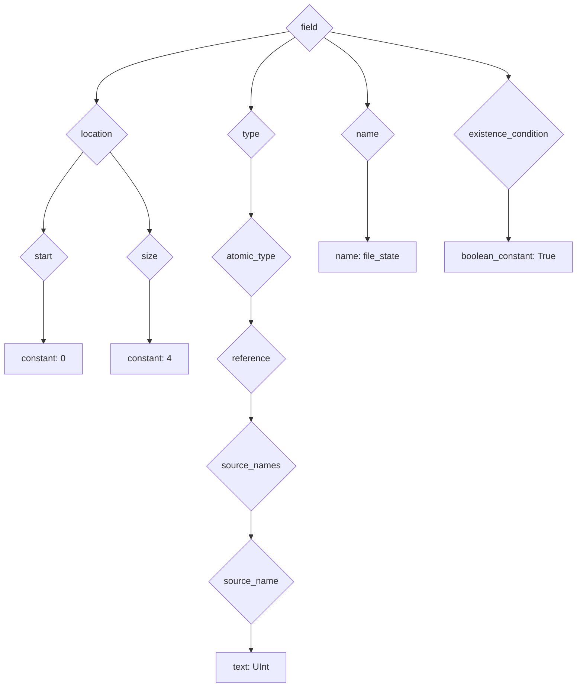
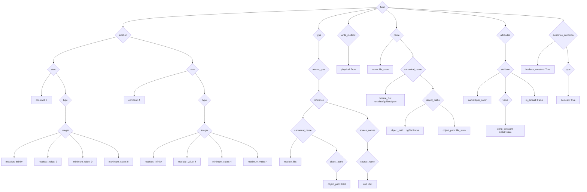

# Design of the Emboss Tool

This document describes the internals of Emboss.  End users do not need to read
this document.

## Overall Design

The Emboss compiler follows a reasonably standard compiler design, where the
input source text is first converted to an *intermediate representation* (IR),
then various operations are performed on the IR, and finally the IR is used to
construct the final output — at the time of writing, C++ source code:


Currently, Emboss is split into two programs: the *front end*, which parses the
input and does almost all of the IR processing, and the *C++ back end*, which
does a minimal amount of C++-specific IR processing and generates the final C++
code.  This split makes it straightforward to add new back ends later:


### IR

Most of the Emboss compiler operates on a data structure known as an *IR*, or
intermediate representation.  The Emboss IR is a tree, with node types defined
in [compiler/util/ir_data.py][ir_data_py].

[ir_data_py]: ../compiler/util/ir_data.py

The first stage of the compiler — the parser — generates an "initial" IR, which
only contains information that is directly available in the source tree.  Even
without any further information, the initial IR can be quite large even for a
very short `.emb` file.  For example, this line:

```emb
  0  [+4]   UInt        file_state
```

turns into this IR (in JSON serialization) immediately after parsing:

```json
{
  "location": {
    "start": {
      "constant": {
        "value": "0",
        "source_location": "22:3-22:4"
      },
      "source_location": "22:3-22:4"
    },
    "size": {
      "constant": {
        "value": "4",
        "source_location": "22:8-22:9"
      },
      "source_location": "22:8-22:9"
    },
    "source_location": "22:3-22:10"
  },
  "type": {
    "atomic_type": {
      "reference": {
        "source_name": [
          {
            "text": "UInt",
            "source_location": "22:13-22:17"
          }
        ],
        "source_location": "22:13-22:17"
      },
      "source_location": "22:13-22:17"
    },
    "source_location": "22:13-22:17"
  },
  "name": {
    "name": {
      "text": "file_state",
      "source_location": "22:25-22:35"
    },
    "source_location": "22:25-22:35"
  },
  "existence_condition": {
    "boolean_constant": {
      "value": true,
      "source_location": "22:3-22:35"
    },
    "source_location": "22:3-22:35"
  },
  "source_location": "22:3-22:35"
}
```

In graphical form (with `source_location` nodes omitted for clarity):



This initial IR then goes through a series of *elaborations*, which annotate
the IR, and *validations*, which check various properties of the IR.  These are implemented as *stages* in the compiler:

```mermaid
%%{init: {"flowchart": {"htmlLabels": false}} }%%
graph LR
    diskstart@{ shape: doc, label: "example.emb" }
    parser["Parser"]
    stage1@{ shape: proc, label: "Stage 1" }
    stage2@{ shape: proc, label: "Stage 2" }
    stagenm1@{ shape: proc, label: "Stage N-1" }
    stagen@{ shape: proc, label: "Stage N" }
    backend["C++ Code Generator"]
    diskend@{ shape: doc, label: "example.emb.h" }
    diskstart-->parser
    parser-->stage1
    stage1-->stage2
    stage2---|...|--->stagenm1
    stagenm1-->stagen
    stagen-->backend
    backend-->diskend
```

In many cases, elaborations and validations are mixed together — for example,
in the symbol resolution stage, names in the IR (`field`) are *elaborated* with
the absolute symbol to which they resolve (`module.Type.field`), and, at the
same time, the symbol resolver *validates* that every name resolves to exactly
one absolute symbol.  At the end of this process, the IR is much larger:




### Front End vs Back End(s)

The Emboss compiler is divided into a front end, which does most of the work,
and back ends, which do language-specific validations and translate the final
IR to the final output format.  Currently, only a C++ back end exists.

The compiler is structured so that the front end and back end can run as
separate programs, and when building with Bazel they do run separately.  For
efficiency, the [`embossc`][embossc_source] driver just imports the front end
and C++ back end directly, so that it can skip the JSON serialization and
deserialization steps.

[embossc_source]: ../embossc

The front end consists of (as of the time of writing) 14 stages:

1.  Tokenization
2.  Parse Tree Generation
3.  Parse Tree → IR
4.  Desugaring + Built-In Field Synthesis
5.  Symbol Resolution Part 1: Head Symbols
6.  Dependency Cycle Checking
7.  Dependency Order Computation
8.  Symbol Resolution Part 2: Field Access
9.  Type Annotation
10. Type Checking
11. Bounds Computation
12. Front End Attribute Normalization + Verification
13. Miscellaneous Constraint Checking
14. Inferred Write Method Generation

Each of these stages will be explained in more detail later in this document.

The C++ back end is much simpler, with only 2 stages:

1. Back-End Attribute Normalization + Verification
2. C++ Header Generation


### IR Traversal

Most stages walk the IR one (or more) times, processing or checking specific
types of nodes.  The Emboss compiler uses a special
[`fast_traverse_ir_top_down()`][traverse_ir] function that takes a *pattern*
and calls a handler on all nodes that match that pattern.
`fast_traverse_ir_top_down()` has been optimized to walk trees efficiently: it
will skip branches if no node in the branch could possibly match the pattern.

[traverse_ir]: ../compiler/util/traverse_ir.py#:~:def%20fast_traverse_ir_top_down

For example, this will call `print()` every `Word` in the IR:

```
fast_traverse_ir_top_down(ir, [ir_data.Word], print)
```

Or you could limit the scope to only `Word` nodes inside of `Import` nodes:

```
fast_traverse_ir_top_down(ir, [ir_data.Import, ir_data.Word], print)
```

`fast_traverse_ir_top_down()` has a lot of options.  For full usage, see
[its documentation in the source code][traverse_ir].


### Error Handling

The general scheme for running stages is:

```
for stage in stages:
    next_ir, errors = stage(prev_ir)
    if errors:
        return None, errors
    prev_ir = next_ir
return prev_ir, None
```

That is: run each stage, and if the stage returns any errors, stop processing
and return the error(s).

Errors are represented by lists of [messages][error_py] (`error`, `warning` or
`note`), where, generally, the first message will be an `error` or `warning`,
and any subsequent messages are `note` messages that provide additional
information.

[error_py]: ../compiler/util/error.py


## Front End

*Implemented in [compiler/front_end/...][front_end]*

[front_end]: ../compiler/front_end/

The front end is responsible for reading in Emboss definitions and producing a
normalized intermediate representation (IR).  It is divided into several steps:
roughly, parsing, import resolution, symbol resolution, and validation.

The front end is orchestrated by [glue.py][glue_py], which runs each front end
component in the proper order to construct an IR suitable for consumption by the
back end.

[glue_py]: ../front_end/glue.py

The front end driver program is [emboss_front_end.py][emboss_front_end_py],
which just calls `glue.ParseEmbossFile` and prints the results.

[emboss_front_end_py]: ../front_end/emboss_front_end.py


### Tokenization and Parsing

The first part of the front end translates the text of the `.emb` input into an
IR structure.


#### Tokenization

The very first stage is tokenization, also called lexical analysis.
Tokenization breaks the input text into *tokens* of one or more characters.
For example, take the string `abc+def`:

```
+---+---+---+---+---+---+---+
| a | b | c | + | d | e | f |
+---+---+---+---+---+---+---+
```

This will be grouped into three tokens, `abc`, `+`, and `def`:

```
+-----------+-----+-----------+
| abc       | +   | def       |
| SnakeWord | "+" | SnakeWord |
+-----------+-----+-----------+
```

In addition, each token is labeled with a category, such as `Documentation`,
`Number`, or `"*"`: by convention, tokens that are always a specific sequence
of characters are given a label that is just the token in double quotes, such
as `"+"` for `+`, `"=="` for `==`, `"if"` for `if`, and so on.

These category labels match names in the grammar in the next step...


#### Parse Tree Generation

The list of tokens is then passed to a [shift-reduce (also known as "LR(1)")
parser][shift_reduce], which produces a parse tree.


1.  Tokenization
2.  Parse Tree Generation
3.  Parse Tree → IR
4.  Desugaring + Built-In Field Synthesis
5.  Symbol Resolution Part 1: Head Symbols
6.  Dependency Cycle Checking
7.  Dependency Order Computation
8.  Symbol Resolution Part 2: Field Access
9.  Type Annotation
10. Type Checking
11. Bounds Computation
12. Front End Attribute Normalization + Verification
13. Miscellaneous Constraint Checking
14. Inferred Write Method Generation


### File Parsing

Per-file parsing consumes the text of a single Emboss module, and produces an
"undecorated" IR for the module, containing only syntactic-level information
from the module.

This "undecorated" IR is (almost) a subset of the final IR: later steps will add
information and perform validation, but will rarely remove anything from the IR
before it is emitted.

#### Tokenization

*Implemented in [tokenizer.py][tokenizer_py]*

[tokenizer_py]: front_end/tokenizer.py

The tokenizer is a fairly standard tokenizer, with Indent/Dedent insertion a la
Python.  It divides source text into `parse_types.Symbol` objects, suitable for
feeding into the parser.

#### Syntax Tree Generation

*Implemented in [lr1.py][lr1_py] and [parser_generator.py][parser_generator_py], with a fa&ccedil;ade in [structure_parser.py][structure_parser_py]*

[lr1_py]: front_end/lr1.py
[parser_generator_py]: front_end/parser_generator.py
[structure_parser_py]: front_end/structure_parser.py

Emboss uses a pretty standard Shift-Reduce LR(1) parser.  This is implemented in
three parts in Emboss:

* A generic parser generator implementing the table generation algorithms from
  *[Compilers: Principles, Techniques, & Tools][dragon_book]* and the
  error-marking algorithm from *[Generating LR Syntax Error Messages from
  Examples][jeffery_2003]*.
* An Emboss-specific parser builder which glues the Emboss tokenizer, grammar,
  and error examples to the parser generator, producing an Emboss parser.
* The Emboss grammar, which is extracted from the file normalizer
  (*[module_ir.py][module_ir_py]*).

[dragon_book]: http://www.amazon.com/Compilers-Principles-Techniques-Tools-2nd/dp/0321486811
[jeffery_2003]: http://dl.acm.org/citation.cfm?id=937566

#### Normalization

*Implemented in [module_ir.py][module_ir_py]*

[module_ir_py]: front_end/module_ir.py

Once a parse tree has been generated, it is fed into a normalizer which
recursively turns the raw syntax tree into a "first stage" intermediate
representation (IR).  The first stage IR serves to isolate later stages from
minor changes in the grammar, but only contains information from a single file,
and does not perform any semantic checking.

### Import Resolution

*TODO(bolms): Implement imports.*

After each file is parsed, any new imports it has are added to a work queue.
Each file in the work queue is parsed, potentially adding more imports to the
queue, until the queue is empty.

### Symbol Resolution

*Implemented in [symbol_resolver.py][symbol_resolver_py]*

[symbol_resolver_py]: front_end/symbol_resolver.py

Symbol resolution is the process of correlating names in the IR.  At the end of
symbol resolution, every named entity (type definition, field definition, enum
name, etc.) has a `CanonicalName`, and every reference in the IR has a
`Reference` to the entity to which it refers.

This assignment occurs in two passes.  First, the full IR is scanned, generating
scoped symbol tables (nested dictionaries of names to `CanonicalName`), and
assigning identities to each `Name` in the IR.  Then the IR is fully scanned a
second time, and each `Reference` in the IR is resolved: all scopes visible to
the reference are scanned for the name, and the corresponding `CanonicalName` is
assigned to the reference.

### Validation

*TODO(bolms): other validations?*

#### Size Checking

*TODO(bolms): describe*

#### Overlap Checking

*TODO(bolms): describe*

## Back End

*Implemented in [back_end/...][back_end]*

[back_end]: back_end/

Currently, only a C++ back end is implemented.

A back end takes Emboss IR and produces code in a specific language for
manipulating the Emboss-defined data structures.

### C++

*Implemented in [header_generator.py][header_generator_py] with templates in
[generated_code_templates][generated_code_templates], support code in
[emboss_cpp_util.h][emboss_cpp_util_h], and a driver program in
[emboss_codegen_cpp.py][emboss_codegen_cpp_py]*

[header_generator_py]: back_end/cpp/header_generator.py
[generated_code_templates]: back_end/cpp/generated_code_templates
[emboss_cpp_util_h]: back_end/cpp/emboss_cpp_util.h
[emboss_codegen_cpp_py]: back_end/cpp/emboss_codegen_cpp.py

The C++ code generator is currently very minimal.  `header_generator.py`
essentially inserts values from the IR into text templates.

*TODO(bolms): add more documentation once the C++ back end has more features.*
