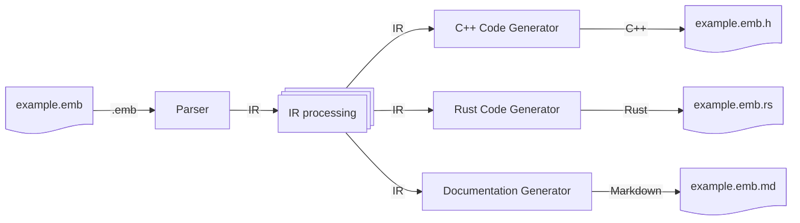

# Design of the Emboss Tool

This document describes the internals of Emboss.  End users do not need to read
this document.

## Overall Design

The Emboss compiler follows a reasonably standard compiler design, where the
input source text is first converted to an *intermediate representation* (IR),
then various operations are performed on the IR, and finally the IR is used to
construct the final output — at the time of writing, C++ source code:


Currently, Emboss is split into two programs: the *front end*, which parses the
input and does almost all of the IR processing, and the *C++ back end*, which
does a minimal amount of C++-specific IR processing and generates the final C++
code.  This split makes it straightforward to add new back ends later:




### IR

Most of the Emboss compiler operates on a data structure known as an *IR*, or
intermediate representation.  The Emboss IR is a tree, with node types defined
in [compiler/util/ir_data.py][ir_data_py].

[ir_data_py]: ../compiler/util/ir_data.py

The first stage of the compiler — the parser — generates an "initial" IR, which
only contains information that is directly available in the source tree.  Even
without any further information, the initial IR can be quite large even for a
very short `.emb` file.  For example, this `.emb`:

```emb
# Copyright 2019 Google LLC

-- This is a simple, real-world example structure.

[$default byte_order: "LittleEndian"]
[(cpp) namespace: "emboss::test"]


struct LogFileStatus:
  0  [+4]   UInt        file_state
  4  [+12]  UInt:8[12]  file_name
  16 [+4]   UInt        file_size_kb
  20 [+4]   UInt        media
```

turns into this IR immediately after parsing:

```mermaid
graph TD
    n0@{ shape: diamond, label: "module" }
    n1@{ shape: diamond, label: "attributes" }
    n0 --> n1
    n0 --> n6
    n0 --> n59
    n0 --> n61
    n0 --> l34
    n1 --> n2
    n1 --> n4
    n2@{ shape: diamond, label: "attribute" }
    n2 --> l0
    n2 --> n3
    n2 --> l2
    n3@{ shape: diamond, label: "value" }
    n3 --> l1
    n4@{ shape: diamond, label: "attribute" }
    n4 --> l3
    n4 --> n5
    n4 --> l5
    n4 --> l6
    n5@{ shape: diamond, label: "value" }
    n5 --> l4
    n6@{ shape: diamond, label: "types" }
    n6 --> n7
    n7@{ shape: diamond, label: "type" }
    n7 --> n8
    n7 --> l29
    n7 --> n58
    n8@{ shape: diamond, label: "structure" }
    n8 --> n9
    n9@{ shape: diamond, label: "fields" }
    n9 --> n10
    n9 --> n21
    n9 --> n36
    n9 --> n47
    n10@{ shape: diamond, label: "field" }
    n10 --> n11
    n10 --> n14
    n10 --> n19
    n10 --> n20
    n11@{ shape: diamond, label: "location" }
    n11 --> n12
    n11 --> n13
    n12@{ shape: diamond, label: "start" }
    n12 --> l7
    n13@{ shape: diamond, label: "size" }
    n13 --> l8
    n14@{ shape: diamond, label: "type" }
    n14 --> n15
    n15@{ shape: diamond, label: "atomic_type" }
    n15 --> n16
    n16@{ shape: diamond, label: "reference" }
    n16 --> n17
    n17@{ shape: diamond, label: "source_names" }
    n17 --> n18
    n18@{ shape: diamond, label: "source_name" }
    n18 --> l9
    n19@{ shape: diamond, label: "name" }
    n19 --> l10
    n20@{ shape: diamond, label: "existence_condition" }
    n20 --> l11
    n21@{ shape: diamond, label: "field" }
    n21 --> n22
    n21 --> n25
    n21 --> n34
    n21 --> n35
    n22@{ shape: diamond, label: "location" }
    n22 --> n23
    n22 --> n24
    n23@{ shape: diamond, label: "start" }
    n23 --> l12
    n24@{ shape: diamond, label: "size" }
    n24 --> l13
    n25@{ shape: diamond, label: "type" }
    n25 --> n26
    n26@{ shape: diamond, label: "array_type" }
    n26 --> n27
    n26 --> n33
    n27@{ shape: diamond, label: "base_type" }
    n27 --> n28
    n27 --> n32
    n28@{ shape: diamond, label: "atomic_type" }
    n28 --> n29
    n29@{ shape: diamond, label: "reference" }
    n29 --> n30
    n30@{ shape: diamond, label: "source_names" }
    n30 --> n31
    n31@{ shape: diamond, label: "source_name" }
    n31 --> l14
    n32@{ shape: diamond, label: "size_in_bits" }
    n32 --> l15
    n33@{ shape: diamond, label: "element_count" }
    n33 --> l16
    n34@{ shape: diamond, label: "name" }
    n34 --> l17
    n35@{ shape: diamond, label: "existence_condition" }
    n35 --> l18
    n36@{ shape: diamond, label: "field" }
    n36 --> n37
    n36 --> n40
    n36 --> n45
    n36 --> n46
    n37@{ shape: diamond, label: "location" }
    n37 --> n38
    n37 --> n39
    n38@{ shape: diamond, label: "start" }
    n38 --> l19
    n39@{ shape: diamond, label: "size" }
    n39 --> l20
    n40@{ shape: diamond, label: "type" }
    n40 --> n41
    n41@{ shape: diamond, label: "atomic_type" }
    n41 --> n42
    n42@{ shape: diamond, label: "reference" }
    n42 --> n43
    n43@{ shape: diamond, label: "source_names" }
    n43 --> n44
    n44@{ shape: diamond, label: "source_name" }
    n44 --> l21
    n45@{ shape: diamond, label: "name" }
    n45 --> l22
    n46@{ shape: diamond, label: "existence_condition" }
    n46 --> l23
    n47@{ shape: diamond, label: "field" }
    n47 --> n48
    n47 --> n51
    n47 --> n56
    n47 --> n57
    n48@{ shape: diamond, label: "location" }
    n48 --> n49
    n48 --> n50
    n49@{ shape: diamond, label: "start" }
    n49 --> l24
    n50@{ shape: diamond, label: "size" }
    n50 --> l25
    n51@{ shape: diamond, label: "type" }
    n51 --> n52
    n52@{ shape: diamond, label: "atomic_type" }
    n52 --> n53
    n53@{ shape: diamond, label: "reference" }
    n53 --> n54
    n54@{ shape: diamond, label: "source_names" }
    n54 --> n55
    n55@{ shape: diamond, label: "source_name" }
    n55 --> l26
    n56@{ shape: diamond, label: "name" }
    n56 --> l27
    n57@{ shape: diamond, label: "existence_condition" }
    n57 --> l28
    n58@{ shape: diamond, label: "name" }
    n58 --> l30
    n59@{ shape: diamond, label: "documentations" }
    n59 --> n60
    n60@{ shape: diamond, label: "documentation" }
    n60 --> l31
    n61@{ shape: diamond, label: "foreign_imports" }
    n61 --> n62
    n62@{ shape: diamond, label: "foreign_import" }
    n62 --> l32
    n62 --> l33
    l0@{ shape: rect, label: "name: byte_order" }
    l1@{ shape: rect, label: "string_constant: LittleEndian" }
    l2@{ shape: rect, label: "is_default: True" }
    l3@{ shape: rect, label: "name: namespace" }
    l4@{ shape: rect, label: "string_constant: emboss::test" }
    l5@{ shape: rect, label: "is_default: False" }
    l6@{ shape: rect, label: "back_end: cpp" }
    l7@{ shape: rect, label: "constant: 0" }
    l8@{ shape: rect, label: "constant: 4" }
    l9@{ shape: rect, label: "text: UInt" }
    l10@{ shape: rect, label: "name: file_state" }
    l11@{ shape: rect, label: "boolean_constant: True" }
    l12@{ shape: rect, label: "constant: 4" }
    l13@{ shape: rect, label: "constant: 12" }
    l14@{ shape: rect, label: "text: UInt" }
    l15@{ shape: rect, label: "constant: 8" }
    l16@{ shape: rect, label: "constant: 12" }
    l17@{ shape: rect, label: "name: file_name" }
    l18@{ shape: rect, label: "boolean_constant: True" }
    l19@{ shape: rect, label: "constant: 16" }
    l20@{ shape: rect, label: "constant: 4" }
    l21@{ shape: rect, label: "text: UInt" }
    l22@{ shape: rect, label: "name: file_size_kb" }
    l23@{ shape: rect, label: "boolean_constant: True" }
    l24@{ shape: rect, label: "constant: 20" }
    l25@{ shape: rect, label: "constant: 4" }
    l26@{ shape: rect, label: "text: UInt" }
    l27@{ shape: rect, label: "name: media" }
    l28@{ shape: rect, label: "boolean_constant: True" }
    l29@{ shape: rect, label: "addressable_unit: 8" }
    l30@{ shape: rect, label: "name: LogFileStatus" }
    l31@{ shape: rect, label: "text: This is a simple, re" }
    l32@{ shape: rect, label: "file_name: " }
    l33@{ shape: rect, label: "local_name: " }
    l34@{ shape: rect, label: "source_text: # Copyright 2019 Goo" }
```



This initial IR then goes through a series of *elaborations*, which annotate
the IR, and *validations*, which check various properties of the IR.  In many
cases, elaborations and validations are mixed together — for example, in the
symbol resolution stage, names in the IR (`field`) are *elaborated* with the
absolute symbol to which they resolve (`module.Type.field`), and, at the same
time, the symbol resolver *validates* that every name resolves to exactly one
absolute symbol.  At the end of this process, the IR is much larger:

```mermaid
graph TD
    n0@{ shape: diamond, label: "module" }
  n0 --> n1
    n1@{ shape: diamond, label: "modules" }
  n1 --> n2
  n1 --> n284
    n2@{ shape: diamond, label: "module" }
  n2 --> n3
  n2 --> n10
  n2 --> n280
  n2 --> n282
  n2 --> l313
  n2 --> l314
    n3@{ shape: diamond, label: "attributes" }
  n3 --> n4
  n3 --> n6
  n3 --> n8
    n4@{ shape: diamond, label: "attribute" }
  n4 --> l0
  n4 --> n5
  n4 --> l2
    n5@{ shape: diamond, label: "value" }
  n5 --> l1
    n6@{ shape: diamond, label: "attribute" }
  n6 --> l3
  n6 --> n7
  n6 --> l5
  n6 --> l6
    n7@{ shape: diamond, label: "value" }
  n7 --> l4
    n8@{ shape: diamond, label: "attribute" }
  n8 --> l7
  n8 --> n9
    n9@{ shape: diamond, label: "value" }
  n9 --> l8
    n10@{ shape: diamond, label: "types" }
  n10 --> n11
    n11@{ shape: diamond, label: "type" }
  n11 --> n12
  n11 --> n271
  n11 --> n274
  n11 --> l309
    n12@{ shape: diamond, label: "structure" }
  n12 --> n13
  n12 --> n270
    n13@{ shape: diamond, label: "fields" }
  n13 --> n14
  n13 --> n38
  n13 --> n70
  n13 --> n94
  n13 --> n118
  n13 --> n220
  n13 --> n245
    n14@{ shape: diamond, label: "field" }
  n14 --> n15
  n14 --> n22
  n14 --> n29
  n14 --> n30
  n14 --> n33
  n14 --> n36
    n15@{ shape: diamond, label: "location" }
  n15 --> n16
  n15 --> n19
    n16@{ shape: diamond, label: "start" }
  n16 --> l9
  n16 --> n17
    n17@{ shape: diamond, label: "type" }
  n17 --> n18
    n18@{ shape: diamond, label: "integer" }
  n18 --> l10
  n18 --> l11
  n18 --> l12
  n18 --> l13
    n19@{ shape: diamond, label: "size" }
  n19 --> l14
  n19 --> n20
    n20@{ shape: diamond, label: "type" }
  n20 --> n21
    n21@{ shape: diamond, label: "integer" }
  n21 --> l15
  n21 --> l16
  n21 --> l17
  n21 --> l18
    n22@{ shape: diamond, label: "type" }
  n22 --> n23
    n23@{ shape: diamond, label: "atomic_type" }
  n23 --> n24
    n24@{ shape: diamond, label: "reference" }
  n24 --> n25
  n24 --> n27
    n25@{ shape: diamond, label: "canonical_name" }
  n25 --> l19
  n25 --> n26
    n26@{ shape: diamond, label: "object_paths" }
  n26 --> l20
    n27@{ shape: diamond, label: "source_names" }
  n27 --> n28
    n28@{ shape: diamond, label: "source_name" }
  n28 --> l21
    n29@{ shape: diamond, label: "write_method" }
  n29 --> l22
    n30@{ shape: diamond, label: "name" }
  n30 --> l23
  n30 --> n31
    n31@{ shape: diamond, label: "canonical_name" }
  n31 --> l24
  n31 --> n32
    n32@{ shape: diamond, label: "object_paths" }
  n32 --> l25
  n32 --> l26
    n33@{ shape: diamond, label: "attributes" }
  n33 --> n34
    n34@{ shape: diamond, label: "attribute" }
  n34 --> l27
  n34 --> n35
  n34 --> l29
    n35@{ shape: diamond, label: "value" }
  n35 --> l28
    n36@{ shape: diamond, label: "existence_condition" }
  n36 --> l30
  n36 --> n37
    n37@{ shape: diamond, label: "type" }
  n37 --> l31
    n38@{ shape: diamond, label: "field" }
  n38 --> n39
  n38 --> n46
  n38 --> n61
  n38 --> n62
  n38 --> n65
  n38 --> n68
    n39@{ shape: diamond, label: "location" }
  n39 --> n40
  n39 --> n43
    n40@{ shape: diamond, label: "start" }
  n40 --> l32
  n40 --> n41
    n41@{ shape: diamond, label: "type" }
  n41 --> n42
    n42@{ shape: diamond, label: "integer" }
  n42 --> l33
  n42 --> l34
  n42 --> l35
  n42 --> l36
    n43@{ shape: diamond, label: "size" }
  n43 --> l37
  n43 --> n44
    n44@{ shape: diamond, label: "type" }
  n44 --> n45
    n45@{ shape: diamond, label: "integer" }
  n45 --> l38
  n45 --> l39
  n45 --> l40
  n45 --> l41
    n46@{ shape: diamond, label: "type" }
  n46 --> n47
    n47@{ shape: diamond, label: "array_type" }
  n47 --> n48
  n47 --> n58
    n48@{ shape: diamond, label: "base_type" }
  n48 --> n49
  n48 --> n55
    n49@{ shape: diamond, label: "atomic_type" }
  n49 --> n50
    n50@{ shape: diamond, label: "reference" }
  n50 --> n51
  n50 --> n53
    n51@{ shape: diamond, label: "canonical_name" }
  n51 --> l42
  n51 --> n52
    n52@{ shape: diamond, label: "object_paths" }
  n52 --> l43
    n53@{ shape: diamond, label: "source_names" }
  n53 --> n54
    n54@{ shape: diamond, label: "source_name" }
  n54 --> l44
    n55@{ shape: diamond, label: "size_in_bits" }
  n55 --> l45
  n55 --> n56
    n56@{ shape: diamond, label: "type" }
  n56 --> n57
    n57@{ shape: diamond, label: "integer" }
  n57 --> l46
  n57 --> l47
  n57 --> l48
  n57 --> l49
    n58@{ shape: diamond, label: "element_count" }
  n58 --> l50
  n58 --> n59
    n59@{ shape: diamond, label: "type" }
  n59 --> n60
    n60@{ shape: diamond, label: "integer" }
  n60 --> l51
  n60 --> l52
  n60 --> l53
  n60 --> l54
    n61@{ shape: diamond, label: "write_method" }
  n61 --> l55
    n62@{ shape: diamond, label: "name" }
  n62 --> l56
  n62 --> n63
    n63@{ shape: diamond, label: "canonical_name" }
  n63 --> l57
  n63 --> n64
    n64@{ shape: diamond, label: "object_paths" }
  n64 --> l58
  n64 --> l59
    n65@{ shape: diamond, label: "attributes" }
  n65 --> n66
    n66@{ shape: diamond, label: "attribute" }
  n66 --> l60
  n66 --> n67
  n66 --> l62
    n67@{ shape: diamond, label: "value" }
  n67 --> l61
    n68@{ shape: diamond, label: "existence_condition" }
  n68 --> l63
  n68 --> n69
    n69@{ shape: diamond, label: "type" }
  n69 --> l64
    n70@{ shape: diamond, label: "field" }
  n70 --> n71
  n70 --> n78
  n70 --> n85
  n70 --> n86
  n70 --> n89
  n70 --> n92
    n71@{ shape: diamond, label: "location" }
  n71 --> n72
  n71 --> n75
    n72@{ shape: diamond, label: "start" }
  n72 --> l65
  n72 --> n73
    n73@{ shape: diamond, label: "type" }
  n73 --> n74
    n74@{ shape: diamond, label: "integer" }
  n74 --> l66
  n74 --> l67
  n74 --> l68
  n74 --> l69
    n75@{ shape: diamond, label: "size" }
  n75 --> l70
  n75 --> n76
    n76@{ shape: diamond, label: "type" }
  n76 --> n77
    n77@{ shape: diamond, label: "integer" }
  n77 --> l71
  n77 --> l72
  n77 --> l73
  n77 --> l74
    n78@{ shape: diamond, label: "type" }
  n78 --> n79
    n79@{ shape: diamond, label: "atomic_type" }
  n79 --> n80
    n80@{ shape: diamond, label: "reference" }
  n80 --> n81
  n80 --> n83
    n81@{ shape: diamond, label: "canonical_name" }
  n81 --> l75
  n81 --> n82
    n82@{ shape: diamond, label: "object_paths" }
  n82 --> l76
    n83@{ shape: diamond, label: "source_names" }
  n83 --> n84
    n84@{ shape: diamond, label: "source_name" }
  n84 --> l77
    n85@{ shape: diamond, label: "write_method" }
  n85 --> l78
    n86@{ shape: diamond, label: "name" }
  n86 --> l79
  n86 --> n87
    n87@{ shape: diamond, label: "canonical_name" }
  n87 --> l80
  n87 --> n88
    n88@{ shape: diamond, label: "object_paths" }
  n88 --> l81
  n88 --> l82
    n89@{ shape: diamond, label: "attributes" }
  n89 --> n90
    n90@{ shape: diamond, label: "attribute" }
  n90 --> l83
  n90 --> n91
  n90 --> l85
    n91@{ shape: diamond, label: "value" }
  n91 --> l84
    n92@{ shape: diamond, label: "existence_condition" }
  n92 --> l86
  n92 --> n93
    n93@{ shape: diamond, label: "type" }
  n93 --> l87
    n94@{ shape: diamond, label: "field" }
  n94 --> n95
  n94 --> n102
  n94 --> n109
  n94 --> n110
  n94 --> n113
  n94 --> n116
    n95@{ shape: diamond, label: "location" }
  n95 --> n96
  n95 --> n99
    n96@{ shape: diamond, label: "start" }
  n96 --> l88
  n96 --> n97
    n97@{ shape: diamond, label: "type" }
  n97 --> n98
    n98@{ shape: diamond, label: "integer" }
  n98 --> l89
  n98 --> l90
  n98 --> l91
  n98 --> l92
    n99@{ shape: diamond, label: "size" }
  n99 --> l93
  n99 --> n100
    n100@{ shape: diamond, label: "type" }
  n100 --> n101
    n101@{ shape: diamond, label: "integer" }
  n101 --> l94
  n101 --> l95
  n101 --> l96
  n101 --> l97
    n102@{ shape: diamond, label: "type" }
  n102 --> n103
    n103@{ shape: diamond, label: "atomic_type" }
  n103 --> n104
    n104@{ shape: diamond, label: "reference" }
  n104 --> n105
  n104 --> n107
    n105@{ shape: diamond, label: "canonical_name" }
  n105 --> l98
  n105 --> n106
    n106@{ shape: diamond, label: "object_paths" }
  n106 --> l99
    n107@{ shape: diamond, label: "source_names" }
  n107 --> n108
    n108@{ shape: diamond, label: "source_name" }
  n108 --> l100
    n109@{ shape: diamond, label: "write_method" }
  n109 --> l101
    n110@{ shape: diamond, label: "name" }
  n110 --> l102
  n110 --> n111
    n111@{ shape: diamond, label: "canonical_name" }
  n111 --> l103
  n111 --> n112
    n112@{ shape: diamond, label: "object_paths" }
  n112 --> l104
  n112 --> l105
    n113@{ shape: diamond, label: "attributes" }
  n113 --> n114
    n114@{ shape: diamond, label: "attribute" }
  n114 --> l106
  n114 --> n115
  n114 --> l108
    n115@{ shape: diamond, label: "value" }
  n115 --> l107
    n116@{ shape: diamond, label: "existence_condition" }
  n116 --> l109
  n116 --> n117
    n117@{ shape: diamond, label: "type" }
  n117 --> l110
    n118@{ shape: diamond, label: "field" }
  n118 --> n119
  n118 --> n211
  n118 --> n212
  n118 --> n215
  n118 --> n218
    n119@{ shape: diamond, label: "read_transform" }
  n119 --> n120
  n119 --> n209
    n120@{ shape: diamond, label: "function" }
  n120 --> l111
  n120 --> n121
  n120 --> l233
    n121@{ shape: diamond, label: "argss" }
  n121 --> n122
  n121 --> n125
  n121 --> n146
  n121 --> n167
  n121 --> n188
    n122@{ shape: diamond, label: "args" }
  n122 --> l112
  n122 --> n123
    n123@{ shape: diamond, label: "type" }
  n123 --> n124
    n124@{ shape: diamond, label: "integer" }
  n124 --> l113
  n124 --> l114
  n124 --> l115
  n124 --> l116
    n125@{ shape: diamond, label: "args" }
  n125 --> n126
  n125 --> n144
    n126@{ shape: diamond, label: "function" }
  n126 --> l117
  n126 --> n127
  n126 --> l141
    n127@{ shape: diamond, label: "argss" }
  n127 --> n128
  n127 --> n130
  n127 --> n141
    n128@{ shape: diamond, label: "args" }
  n128 --> l118
  n128 --> n129
    n129@{ shape: diamond, label: "type" }
  n129 --> l119
    n130@{ shape: diamond, label: "args" }
  n130 --> n131
  n130 --> n139
    n131@{ shape: diamond, label: "function" }
  n131 --> l120
  n131 --> n132
  n131 --> l131
    n132@{ shape: diamond, label: "argss" }
  n132 --> n133
  n132 --> n136
    n133@{ shape: diamond, label: "args" }
  n133 --> l121
  n133 --> n134
    n134@{ shape: diamond, label: "type" }
  n134 --> n135
    n135@{ shape: diamond, label: "integer" }
  n135 --> l122
  n135 --> l123
  n135 --> l124
  n135 --> l125
    n136@{ shape: diamond, label: "args" }
  n136 --> l126
  n136 --> n137
    n137@{ shape: diamond, label: "type" }
  n137 --> n138
    n138@{ shape: diamond, label: "integer" }
  n138 --> l127
  n138 --> l128
  n138 --> l129
  n138 --> l130
    n139@{ shape: diamond, label: "type" }
  n139 --> n140
    n140@{ shape: diamond, label: "integer" }
  n140 --> l132
  n140 --> l133
  n140 --> l134
  n140 --> l135
    n141@{ shape: diamond, label: "args" }
  n141 --> l136
  n141 --> n142
    n142@{ shape: diamond, label: "type" }
  n142 --> n143
    n143@{ shape: diamond, label: "integer" }
  n143 --> l137
  n143 --> l138
  n143 --> l139
  n143 --> l140
    n144@{ shape: diamond, label: "type" }
  n144 --> n145
    n145@{ shape: diamond, label: "integer" }
  n145 --> l142
  n145 --> l143
  n145 --> l144
  n145 --> l145
    n146@{ shape: diamond, label: "args" }
  n146 --> n147
  n146 --> n165
    n147@{ shape: diamond, label: "function" }
  n147 --> l146
  n147 --> n148
  n147 --> l170
    n148@{ shape: diamond, label: "argss" }
  n148 --> n149
  n148 --> n151
  n148 --> n162
    n149@{ shape: diamond, label: "args" }
  n149 --> l147
  n149 --> n150
    n150@{ shape: diamond, label: "type" }
  n150 --> l148
    n151@{ shape: diamond, label: "args" }
  n151 --> n152
  n151 --> n160
    n152@{ shape: diamond, label: "function" }
  n152 --> l149
  n152 --> n153
  n152 --> l160
    n153@{ shape: diamond, label: "argss" }
  n153 --> n154
  n153 --> n157
    n154@{ shape: diamond, label: "args" }
  n154 --> l150
  n154 --> n155
    n155@{ shape: diamond, label: "type" }
  n155 --> n156
    n156@{ shape: diamond, label: "integer" }
  n156 --> l151
  n156 --> l152
  n156 --> l153
  n156 --> l154
    n157@{ shape: diamond, label: "args" }
  n157 --> l155
  n157 --> n158
    n158@{ shape: diamond, label: "type" }
  n158 --> n159
    n159@{ shape: diamond, label: "integer" }
  n159 --> l156
  n159 --> l157
  n159 --> l158
  n159 --> l159
    n160@{ shape: diamond, label: "type" }
  n160 --> n161
    n161@{ shape: diamond, label: "integer" }
  n161 --> l161
  n161 --> l162
  n161 --> l163
  n161 --> l164
    n162@{ shape: diamond, label: "args" }
  n162 --> l165
  n162 --> n163
    n163@{ shape: diamond, label: "type" }
  n163 --> n164
    n164@{ shape: diamond, label: "integer" }
  n164 --> l166
  n164 --> l167
  n164 --> l168
  n164 --> l169
    n165@{ shape: diamond, label: "type" }
  n165 --> n166
    n166@{ shape: diamond, label: "integer" }
  n166 --> l171
  n166 --> l172
  n166 --> l173
  n166 --> l174
    n167@{ shape: diamond, label: "args" }
  n167 --> n168
  n167 --> n186
    n168@{ shape: diamond, label: "function" }
  n168 --> l175
  n168 --> n169
  n168 --> l199
    n169@{ shape: diamond, label: "argss" }
  n169 --> n170
  n169 --> n172
  n169 --> n183
    n170@{ shape: diamond, label: "args" }
  n170 --> l176
  n170 --> n171
    n171@{ shape: diamond, label: "type" }
  n171 --> l177
    n172@{ shape: diamond, label: "args" }
  n172 --> n173
  n172 --> n181
    n173@{ shape: diamond, label: "function" }
  n173 --> l178
  n173 --> n174
  n173 --> l189
    n174@{ shape: diamond, label: "argss" }
  n174 --> n175
  n174 --> n178
    n175@{ shape: diamond, label: "args" }
  n175 --> l179
  n175 --> n176
    n176@{ shape: diamond, label: "type" }
  n176 --> n177
    n177@{ shape: diamond, label: "integer" }
  n177 --> l180
  n177 --> l181
  n177 --> l182
  n177 --> l183
    n178@{ shape: diamond, label: "args" }
  n178 --> l184
  n178 --> n179
    n179@{ shape: diamond, label: "type" }
  n179 --> n180
    n180@{ shape: diamond, label: "integer" }
  n180 --> l185
  n180 --> l186
  n180 --> l187
  n180 --> l188
    n181@{ shape: diamond, label: "type" }
  n181 --> n182
    n182@{ shape: diamond, label: "integer" }
  n182 --> l190
  n182 --> l191
  n182 --> l192
  n182 --> l193
    n183@{ shape: diamond, label: "args" }
  n183 --> l194
  n183 --> n184
    n184@{ shape: diamond, label: "type" }
  n184 --> n185
    n185@{ shape: diamond, label: "integer" }
  n185 --> l195
  n185 --> l196
  n185 --> l197
  n185 --> l198
    n186@{ shape: diamond, label: "type" }
  n186 --> n187
    n187@{ shape: diamond, label: "integer" }
  n187 --> l200
  n187 --> l201
  n187 --> l202
  n187 --> l203
    n188@{ shape: diamond, label: "args" }
  n188 --> n189
  n188 --> n207
    n189@{ shape: diamond, label: "function" }
  n189 --> l204
  n189 --> n190
  n189 --> l228
    n190@{ shape: diamond, label: "argss" }
  n190 --> n191
  n190 --> n193
  n190 --> n204
    n191@{ shape: diamond, label: "args" }
  n191 --> l205
  n191 --> n192
    n192@{ shape: diamond, label: "type" }
  n192 --> l206
    n193@{ shape: diamond, label: "args" }
  n193 --> n194
  n193 --> n202
    n194@{ shape: diamond, label: "function" }
  n194 --> l207
  n194 --> n195
  n194 --> l218
    n195@{ shape: diamond, label: "argss" }
  n195 --> n196
  n195 --> n199
    n196@{ shape: diamond, label: "args" }
  n196 --> l208
  n196 --> n197
    n197@{ shape: diamond, label: "type" }
  n197 --> n198
    n198@{ shape: diamond, label: "integer" }
  n198 --> l209
  n198 --> l210
  n198 --> l211
  n198 --> l212
    n199@{ shape: diamond, label: "args" }
  n199 --> l213
  n199 --> n200
    n200@{ shape: diamond, label: "type" }
  n200 --> n201
    n201@{ shape: diamond, label: "integer" }
  n201 --> l214
  n201 --> l215
  n201 --> l216
  n201 --> l217
    n202@{ shape: diamond, label: "type" }
  n202 --> n203
    n203@{ shape: diamond, label: "integer" }
  n203 --> l219
  n203 --> l220
  n203 --> l221
  n203 --> l222
    n204@{ shape: diamond, label: "args" }
  n204 --> l223
  n204 --> n205
    n205@{ shape: diamond, label: "type" }
  n205 --> n206
    n206@{ shape: diamond, label: "integer" }
  n206 --> l224
  n206 --> l225
  n206 --> l226
  n206 --> l227
    n207@{ shape: diamond, label: "type" }
  n207 --> n208
    n208@{ shape: diamond, label: "integer" }
  n208 --> l229
  n208 --> l230
  n208 --> l231
  n208 --> l232
    n209@{ shape: diamond, label: "type" }
  n209 --> n210
    n210@{ shape: diamond, label: "integer" }
  n210 --> l234
  n210 --> l235
  n210 --> l236
  n210 --> l237
    n211@{ shape: diamond, label: "write_method" }
  n211 --> l238
    n212@{ shape: diamond, label: "name" }
  n212 --> l239
  n212 --> n213
    n213@{ shape: diamond, label: "canonical_name" }
  n213 --> l240
  n213 --> n214
    n214@{ shape: diamond, label: "object_paths" }
  n214 --> l241
  n214 --> l242
    n215@{ shape: diamond, label: "attributes" }
  n215 --> n216
    n216@{ shape: diamond, label: "attribute" }
  n216 --> l243
  n216 --> n217
    n217@{ shape: diamond, label: "value" }
  n217 --> l244
    n218@{ shape: diamond, label: "existence_condition" }
  n218 --> l245
  n218 --> n219
    n219@{ shape: diamond, label: "type" }
  n219 --> l246
    n220@{ shape: diamond, label: "field" }
  n220 --> n221
  n220 --> n236
  n220 --> n237
  n220 --> n240
  n220 --> n243
    n221@{ shape: diamond, label: "read_transform" }
  n221 --> n222
  n221 --> n234
    n222@{ shape: diamond, label: "function" }
  n222 --> l247
  n222 --> n223
  n222 --> l256
    n223@{ shape: diamond, label: "argss" }
  n223 --> n224
    n224@{ shape: diamond, label: "args" }
  n224 --> n225
  n224 --> n232
    n225@{ shape: diamond, label: "field_reference" }
  n225 --> n226
    n226@{ shape: diamond, label: "paths" }
  n226 --> n227
    n227@{ shape: diamond, label: "path" }
  n227 --> n228
  n227 --> n230
    n228@{ shape: diamond, label: "canonical_name" }
  n228 --> l248
  n228 --> n229
    n229@{ shape: diamond, label: "object_paths" }
  n229 --> l249
  n229 --> l250
    n230@{ shape: diamond, label: "source_names" }
  n230 --> n231
    n231@{ shape: diamond, label: "source_name" }
  n231 --> l251
    n232@{ shape: diamond, label: "type" }
  n232 --> n233
    n233@{ shape: diamond, label: "integer" }
  n233 --> l252
  n233 --> l253
  n233 --> l254
  n233 --> l255
    n234@{ shape: diamond, label: "type" }
  n234 --> n235
    n235@{ shape: diamond, label: "integer" }
  n235 --> l257
  n235 --> l258
  n235 --> l259
  n235 --> l260
    n236@{ shape: diamond, label: "write_method" }
  n236 --> l261
    n237@{ shape: diamond, label: "name" }
  n237 --> l262
  n237 --> n238
    n238@{ shape: diamond, label: "canonical_name" }
  n238 --> l263
  n238 --> n239
    n239@{ shape: diamond, label: "object_paths" }
  n239 --> l264
  n239 --> l265
    n240@{ shape: diamond, label: "attributes" }
  n240 --> n241
    n241@{ shape: diamond, label: "attribute" }
  n241 --> l266
  n241 --> n242
    n242@{ shape: diamond, label: "value" }
  n242 --> l267
    n243@{ shape: diamond, label: "existence_condition" }
  n243 --> l268
  n243 --> n244
    n244@{ shape: diamond, label: "type" }
  n244 --> l269
    n245@{ shape: diamond, label: "field" }
  n245 --> n246
  n245 --> n261
  n245 --> n262
  n245 --> n265
  n245 --> n268
    n246@{ shape: diamond, label: "read_transform" }
  n246 --> n247
  n246 --> n259
    n247@{ shape: diamond, label: "function" }
  n247 --> l270
  n247 --> n248
  n247 --> l279
    n248@{ shape: diamond, label: "argss" }
  n248 --> n249
    n249@{ shape: diamond, label: "args" }
  n249 --> n250
  n249 --> n257
    n250@{ shape: diamond, label: "field_reference" }
  n250 --> n251
    n251@{ shape: diamond, label: "paths" }
  n251 --> n252
    n252@{ shape: diamond, label: "path" }
  n252 --> n253
  n252 --> n255
    n253@{ shape: diamond, label: "canonical_name" }
  n253 --> l271
  n253 --> n254
    n254@{ shape: diamond, label: "object_paths" }
  n254 --> l272
  n254 --> l273
    n255@{ shape: diamond, label: "source_names" }
  n255 --> n256
    n256@{ shape: diamond, label: "source_name" }
  n256 --> l274
    n257@{ shape: diamond, label: "type" }
  n257 --> n258
    n258@{ shape: diamond, label: "integer" }
  n258 --> l275
  n258 --> l276
  n258 --> l277
  n258 --> l278
    n259@{ shape: diamond, label: "type" }
  n259 --> n260
    n260@{ shape: diamond, label: "integer" }
  n260 --> l280
  n260 --> l281
  n260 --> l282
  n260 --> l283
    n261@{ shape: diamond, label: "write_method" }
  n261 --> l284
    n262@{ shape: diamond, label: "name" }
  n262 --> l285
  n262 --> n263
    n263@{ shape: diamond, label: "canonical_name" }
  n263 --> l286
  n263 --> n264
    n264@{ shape: diamond, label: "object_paths" }
  n264 --> l287
  n264 --> l288
    n265@{ shape: diamond, label: "attributes" }
  n265 --> n266
    n266@{ shape: diamond, label: "attribute" }
  n266 --> l289
  n266 --> n267
    n267@{ shape: diamond, label: "value" }
  n267 --> l290
    n268@{ shape: diamond, label: "existence_condition" }
  n268 --> l291
  n268 --> n269
    n269@{ shape: diamond, label: "type" }
  n269 --> l292
    n270@{ shape: diamond, label: "fields_in_dependency_orders" }
  n270 --> l293
  n270 --> l294
  n270 --> l295
  n270 --> l296
  n270 --> l297
  n270 --> l298
  n270 --> l299
    n271@{ shape: diamond, label: "name" }
  n271 --> l300
  n271 --> n272
    n272@{ shape: diamond, label: "canonical_name" }
  n272 --> l301
  n272 --> n273
    n273@{ shape: diamond, label: "object_paths" }
  n273 --> l302
    n274@{ shape: diamond, label: "attributes" }
  n274 --> n275
    n275@{ shape: diamond, label: "attribute" }
  n275 --> l303
  n275 --> n276
    n276@{ shape: diamond, label: "value" }
  n276 --> n277
    n277@{ shape: diamond, label: "expression" }
  n277 --> l304
  n277 --> n278
    n278@{ shape: diamond, label: "type" }
  n278 --> n279
    n279@{ shape: diamond, label: "integer" }
  n279 --> l305
  n279 --> l306
  n279 --> l307
  n279 --> l308
    n280@{ shape: diamond, label: "documentations" }
  n280 --> n281
    n281@{ shape: diamond, label: "documentation" }
  n281 --> l310
    n282@{ shape: diamond, label: "foreign_imports" }
  n282 --> n283
    n283@{ shape: diamond, label: "foreign_import" }
  n283 --> l311
  n283 --> l312
    n284@{ shape: diamond, label: "module" }
  n284 --> n285
  n284 --> n290
  n284 --> n599
  n284 --> n605
  n284 --> l619
  n284 --> l620
    n285@{ shape: diamond, label: "attributes" }
  n285 --> n286
  n285 --> n288
    n286@{ shape: diamond, label: "attribute" }
  n286 --> l315
  n286 --> n287
  n286 --> l317
  n286 --> l318
    n287@{ shape: diamond, label: "value" }
  n287 --> l316
    n288@{ shape: diamond, label: "attribute" }
  n288 --> l319
  n288 --> n289
    n289@{ shape: diamond, label: "value" }
  n289 --> l320
    n290@{ shape: diamond, label: "types" }
  n290 --> n291
  n290 --> n354
  n290 --> n417
  n290 --> n487
  n290 --> n536
    n291@{ shape: diamond, label: "type" }
  n291 --> l321
  n291 --> n292
  n291 --> n295
  n291 --> n352
  n291 --> l379
    n292@{ shape: diamond, label: "name" }
  n292 --> l322
  n292 --> n293
    n293@{ shape: diamond, label: "canonical_name" }
  n293 --> l323
  n293 --> n294
    n294@{ shape: diamond, label: "object_paths" }
  n294 --> l324
    n295@{ shape: diamond, label: "attributes" }
  n295 --> n296
  n295 --> n343
  n295 --> n347
    n296@{ shape: diamond, label: "attribute" }
  n296 --> l325
  n296 --> n297
  n296 --> l366
    n297@{ shape: diamond, label: "value" }
  n297 --> n298
    n298@{ shape: diamond, label: "expression" }
  n298 --> n299
  n298 --> n342
    n299@{ shape: diamond, label: "function" }
  n299 --> l326
  n299 --> n300
  n299 --> l364
    n300@{ shape: diamond, label: "argss" }
  n300 --> n301
  n300 --> n308
    n301@{ shape: diamond, label: "args" }
  n301 --> n302
  n301 --> n307
    n302@{ shape: diamond, label: "builtin_reference" }
  n302 --> n303
  n302 --> n305
    n303@{ shape: diamond, label: "canonical_name" }
  n303 --> l327
  n303 --> n304
    n304@{ shape: diamond, label: "object_paths" }
  n304 --> l328
    n305@{ shape: diamond, label: "source_names" }
  n305 --> n306
    n306@{ shape: diamond, label: "source_name" }
  n306 --> l329
    n307@{ shape: diamond, label: "type" }
  n307 --> l330
    n308@{ shape: diamond, label: "args" }
  n308 --> n309
  n308 --> n341
    n309@{ shape: diamond, label: "function" }
  n309 --> l331
  n309 --> n310
  n309 --> l362
    n310@{ shape: diamond, label: "argss" }
  n310 --> n311
  n310 --> n326
    n311@{ shape: diamond, label: "args" }
  n311 --> n312
  n311 --> n325
    n312@{ shape: diamond, label: "function" }
  n312 --> l332
  n312 --> n313
  n312 --> l345
    n313@{ shape: diamond, label: "argss" }
  n313 --> n314
  n313 --> n317
    n314@{ shape: diamond, label: "args" }
  n314 --> l333
  n314 --> n315
    n315@{ shape: diamond, label: "type" }
  n315 --> n316
    n316@{ shape: diamond, label: "integer" }
  n316 --> l334
  n316 --> l335
  n316 --> l336
  n316 --> l337
    n317@{ shape: diamond, label: "args" }
  n317 --> n318
  n317 --> n323
    n318@{ shape: diamond, label: "builtin_reference" }
  n318 --> n319
  n318 --> n321
    n319@{ shape: diamond, label: "canonical_name" }
  n319 --> l338
  n319 --> n320
    n320@{ shape: diamond, label: "object_paths" }
  n320 --> l339
    n321@{ shape: diamond, label: "source_names" }
  n321 --> n322
    n322@{ shape: diamond, label: "source_name" }
  n322 --> l340
    n323@{ shape: diamond, label: "type" }
  n323 --> n324
    n324@{ shape: diamond, label: "integer" }
  n324 --> l341
  n324 --> l342
  n324 --> l343
  n324 --> l344
    n325@{ shape: diamond, label: "type" }
  n325 --> l346
    n326@{ shape: diamond, label: "args" }
  n326 --> n327
  n326 --> n340
    n327@{ shape: diamond, label: "function" }
  n327 --> l347
  n327 --> n328
  n327 --> l360
    n328@{ shape: diamond, label: "argss" }
  n328 --> n329
  n328 --> n337
    n329@{ shape: diamond, label: "args" }
  n329 --> n330
  n329 --> n335
    n330@{ shape: diamond, label: "builtin_reference" }
  n330 --> n331
  n330 --> n333
    n331@{ shape: diamond, label: "canonical_name" }
  n331 --> l348
  n331 --> n332
    n332@{ shape: diamond, label: "object_paths" }
  n332 --> l349
    n333@{ shape: diamond, label: "source_names" }
  n333 --> n334
    n334@{ shape: diamond, label: "source_name" }
  n334 --> l350
    n335@{ shape: diamond, label: "type" }
  n335 --> n336
    n336@{ shape: diamond, label: "integer" }
  n336 --> l351
  n336 --> l352
  n336 --> l353
  n336 --> l354
    n337@{ shape: diamond, label: "args" }
  n337 --> l355
  n337 --> n338
    n338@{ shape: diamond, label: "type" }
  n338 --> n339
    n339@{ shape: diamond, label: "integer" }
  n339 --> l356
  n339 --> l357
  n339 --> l358
  n339 --> l359
    n340@{ shape: diamond, label: "type" }
  n340 --> l361
    n341@{ shape: diamond, label: "type" }
  n341 --> l363
    n342@{ shape: diamond, label: "type" }
  n342 --> l365
    n343@{ shape: diamond, label: "attribute" }
  n343 --> l367
  n343 --> n344
  n343 --> l370
    n344@{ shape: diamond, label: "value" }
  n344 --> n345
    n345@{ shape: diamond, label: "expression" }
  n345 --> l368
  n345 --> n346
    n346@{ shape: diamond, label: "type" }
  n346 --> l369
    n347@{ shape: diamond, label: "attribute" }
  n347 --> l371
  n347 --> n348
  n347 --> l377
    n348@{ shape: diamond, label: "value" }
  n348 --> n349
    n349@{ shape: diamond, label: "expression" }
  n349 --> l372
  n349 --> n350
    n350@{ shape: diamond, label: "type" }
  n350 --> n351
    n351@{ shape: diamond, label: "integer" }
  n351 --> l373
  n351 --> l374
  n351 --> l375
  n351 --> l376
    n352@{ shape: diamond, label: "documentations" }
  n352 --> n353
    n353@{ shape: diamond, label: "documentation" }
  n353 --> l378
    n354@{ shape: diamond, label: "type" }
  n354 --> l380
  n354 --> n355
  n354 --> n358
  n354 --> n415
  n354 --> l438
    n355@{ shape: diamond, label: "name" }
  n355 --> l381
  n355 --> n356
    n356@{ shape: diamond, label: "canonical_name" }
  n356 --> l382
  n356 --> n357
    n357@{ shape: diamond, label: "object_paths" }
  n357 --> l383
    n358@{ shape: diamond, label: "attributes" }
  n358 --> n359
  n358 --> n406
  n358 --> n410
    n359@{ shape: diamond, label: "attribute" }
  n359 --> l384
  n359 --> n360
  n359 --> l425
    n360@{ shape: diamond, label: "value" }
  n360 --> n361
    n361@{ shape: diamond, label: "expression" }
  n361 --> n362
  n361 --> n405
    n362@{ shape: diamond, label: "function" }
  n362 --> l385
  n362 --> n363
  n362 --> l423
    n363@{ shape: diamond, label: "argss" }
  n363 --> n364
  n363 --> n371
    n364@{ shape: diamond, label: "args" }
  n364 --> n365
  n364 --> n370
    n365@{ shape: diamond, label: "builtin_reference" }
  n365 --> n366
  n365 --> n368
    n366@{ shape: diamond, label: "canonical_name" }
  n366 --> l386
  n366 --> n367
    n367@{ shape: diamond, label: "object_paths" }
  n367 --> l387
    n368@{ shape: diamond, label: "source_names" }
  n368 --> n369
    n369@{ shape: diamond, label: "source_name" }
  n369 --> l388
    n370@{ shape: diamond, label: "type" }
  n370 --> l389
    n371@{ shape: diamond, label: "args" }
  n371 --> n372
  n371 --> n404
    n372@{ shape: diamond, label: "function" }
  n372 --> l390
  n372 --> n373
  n372 --> l421
    n373@{ shape: diamond, label: "argss" }
  n373 --> n374
  n373 --> n389
    n374@{ shape: diamond, label: "args" }
  n374 --> n375
  n374 --> n388
    n375@{ shape: diamond, label: "function" }
  n375 --> l391
  n375 --> n376
  n375 --> l404
    n376@{ shape: diamond, label: "argss" }
  n376 --> n377
  n376 --> n380
    n377@{ shape: diamond, label: "args" }
  n377 --> l392
  n377 --> n378
    n378@{ shape: diamond, label: "type" }
  n378 --> n379
    n379@{ shape: diamond, label: "integer" }
  n379 --> l393
  n379 --> l394
  n379 --> l395
  n379 --> l396
    n380@{ shape: diamond, label: "args" }
  n380 --> n381
  n380 --> n386
    n381@{ shape: diamond, label: "builtin_reference" }
  n381 --> n382
  n381 --> n384
    n382@{ shape: diamond, label: "canonical_name" }
  n382 --> l397
  n382 --> n383
    n383@{ shape: diamond, label: "object_paths" }
  n383 --> l398
    n384@{ shape: diamond, label: "source_names" }
  n384 --> n385
    n385@{ shape: diamond, label: "source_name" }
  n385 --> l399
    n386@{ shape: diamond, label: "type" }
  n386 --> n387
    n387@{ shape: diamond, label: "integer" }
  n387 --> l400
  n387 --> l401
  n387 --> l402
  n387 --> l403
    n388@{ shape: diamond, label: "type" }
  n388 --> l405
    n389@{ shape: diamond, label: "args" }
  n389 --> n390
  n389 --> n403
    n390@{ shape: diamond, label: "function" }
  n390 --> l406
  n390 --> n391
  n390 --> l419
    n391@{ shape: diamond, label: "argss" }
  n391 --> n392
  n391 --> n400
    n392@{ shape: diamond, label: "args" }
  n392 --> n393
  n392 --> n398
    n393@{ shape: diamond, label: "builtin_reference" }
  n393 --> n394
  n393 --> n396
    n394@{ shape: diamond, label: "canonical_name" }
  n394 --> l407
  n394 --> n395
    n395@{ shape: diamond, label: "object_paths" }
  n395 --> l408
    n396@{ shape: diamond, label: "source_names" }
  n396 --> n397
    n397@{ shape: diamond, label: "source_name" }
  n397 --> l409
    n398@{ shape: diamond, label: "type" }
  n398 --> n399
    n399@{ shape: diamond, label: "integer" }
  n399 --> l410
  n399 --> l411
  n399 --> l412
  n399 --> l413
    n400@{ shape: diamond, label: "args" }
  n400 --> l414
  n400 --> n401
    n401@{ shape: diamond, label: "type" }
  n401 --> n402
    n402@{ shape: diamond, label: "integer" }
  n402 --> l415
  n402 --> l416
  n402 --> l417
  n402 --> l418
    n403@{ shape: diamond, label: "type" }
  n403 --> l420
    n404@{ shape: diamond, label: "type" }
  n404 --> l422
    n405@{ shape: diamond, label: "type" }
  n405 --> l424
    n406@{ shape: diamond, label: "attribute" }
  n406 --> l426
  n406 --> n407
  n406 --> l429
    n407@{ shape: diamond, label: "value" }
  n407 --> n408
    n408@{ shape: diamond, label: "expression" }
  n408 --> l427
  n408 --> n409
    n409@{ shape: diamond, label: "type" }
  n409 --> l428
    n410@{ shape: diamond, label: "attribute" }
  n410 --> l430
  n410 --> n411
  n410 --> l436
    n411@{ shape: diamond, label: "value" }
  n411 --> n412
    n412@{ shape: diamond, label: "expression" }
  n412 --> l431
  n412 --> n413
    n413@{ shape: diamond, label: "type" }
  n413 --> n414
    n414@{ shape: diamond, label: "integer" }
  n414 --> l432
  n414 --> l433
  n414 --> l434
  n414 --> l435
    n415@{ shape: diamond, label: "documentations" }
  n415 --> n416
    n416@{ shape: diamond, label: "documentation" }
  n416 --> l437
    n417@{ shape: diamond, label: "type" }
  n417 --> l439
  n417 --> n418
  n417 --> n421
  n417 --> n478
  n417 --> l504
    n418@{ shape: diamond, label: "name" }
  n418 --> l440
  n418 --> n419
    n419@{ shape: diamond, label: "canonical_name" }
  n419 --> l441
  n419 --> n420
    n420@{ shape: diamond, label: "object_paths" }
  n420 --> l442
    n421@{ shape: diamond, label: "attributes" }
  n421 --> n422
  n421 --> n469
  n421 --> n473
    n422@{ shape: diamond, label: "attribute" }
  n422 --> l443
  n422 --> n423
  n422 --> l484
    n423@{ shape: diamond, label: "value" }
  n423 --> n424
    n424@{ shape: diamond, label: "expression" }
  n424 --> n425
  n424 --> n468
    n425@{ shape: diamond, label: "function" }
  n425 --> l444
  n425 --> n426
  n425 --> l482
    n426@{ shape: diamond, label: "argss" }
  n426 --> n427
  n426 --> n434
    n427@{ shape: diamond, label: "args" }
  n427 --> n428
  n427 --> n433
    n428@{ shape: diamond, label: "builtin_reference" }
  n428 --> n429
  n428 --> n431
    n429@{ shape: diamond, label: "canonical_name" }
  n429 --> l445
  n429 --> n430
    n430@{ shape: diamond, label: "object_paths" }
  n430 --> l446
    n431@{ shape: diamond, label: "source_names" }
  n431 --> n432
    n432@{ shape: diamond, label: "source_name" }
  n432 --> l447
    n433@{ shape: diamond, label: "type" }
  n433 --> l448
    n434@{ shape: diamond, label: "args" }
  n434 --> n435
  n434 --> n467
    n435@{ shape: diamond, label: "function" }
  n435 --> l449
  n435 --> n436
  n435 --> l480
    n436@{ shape: diamond, label: "argss" }
  n436 --> n437
  n436 --> n452
    n437@{ shape: diamond, label: "args" }
  n437 --> n438
  n437 --> n451
    n438@{ shape: diamond, label: "function" }
  n438 --> l450
  n438 --> n439
  n438 --> l463
    n439@{ shape: diamond, label: "argss" }
  n439 --> n440
  n439 --> n443
    n440@{ shape: diamond, label: "args" }
  n440 --> l451
  n440 --> n441
    n441@{ shape: diamond, label: "type" }
  n441 --> n442
    n442@{ shape: diamond, label: "integer" }
  n442 --> l452
  n442 --> l453
  n442 --> l454
  n442 --> l455
    n443@{ shape: diamond, label: "args" }
  n443 --> n444
  n443 --> n449
    n444@{ shape: diamond, label: "builtin_reference" }
  n444 --> n445
  n444 --> n447
    n445@{ shape: diamond, label: "canonical_name" }
  n445 --> l456
  n445 --> n446
    n446@{ shape: diamond, label: "object_paths" }
  n446 --> l457
    n447@{ shape: diamond, label: "source_names" }
  n447 --> n448
    n448@{ shape: diamond, label: "source_name" }
  n448 --> l458
    n449@{ shape: diamond, label: "type" }
  n449 --> n450
    n450@{ shape: diamond, label: "integer" }
  n450 --> l459
  n450 --> l460
  n450 --> l461
  n450 --> l462
    n451@{ shape: diamond, label: "type" }
  n451 --> l464
    n452@{ shape: diamond, label: "args" }
  n452 --> n453
  n452 --> n466
    n453@{ shape: diamond, label: "function" }
  n453 --> l465
  n453 --> n454
  n453 --> l478
    n454@{ shape: diamond, label: "argss" }
  n454 --> n455
  n454 --> n463
    n455@{ shape: diamond, label: "args" }
  n455 --> n456
  n455 --> n461
    n456@{ shape: diamond, label: "builtin_reference" }
  n456 --> n457
  n456 --> n459
    n457@{ shape: diamond, label: "canonical_name" }
  n457 --> l466
  n457 --> n458
    n458@{ shape: diamond, label: "object_paths" }
  n458 --> l467
    n459@{ shape: diamond, label: "source_names" }
  n459 --> n460
    n460@{ shape: diamond, label: "source_name" }
  n460 --> l468
    n461@{ shape: diamond, label: "type" }
  n461 --> n462
    n462@{ shape: diamond, label: "integer" }
  n462 --> l469
  n462 --> l470
  n462 --> l471
  n462 --> l472
    n463@{ shape: diamond, label: "args" }
  n463 --> l473
  n463 --> n464
    n464@{ shape: diamond, label: "type" }
  n464 --> n465
    n465@{ shape: diamond, label: "integer" }
  n465 --> l474
  n465 --> l475
  n465 --> l476
  n465 --> l477
    n466@{ shape: diamond, label: "type" }
  n466 --> l479
    n467@{ shape: diamond, label: "type" }
  n467 --> l481
    n468@{ shape: diamond, label: "type" }
  n468 --> l483
    n469@{ shape: diamond, label: "attribute" }
  n469 --> l485
  n469 --> n470
  n469 --> l488
    n470@{ shape: diamond, label: "value" }
  n470 --> n471
    n471@{ shape: diamond, label: "expression" }
  n471 --> l486
  n471 --> n472
    n472@{ shape: diamond, label: "type" }
  n472 --> l487
    n473@{ shape: diamond, label: "attribute" }
  n473 --> l489
  n473 --> n474
  n473 --> l495
    n474@{ shape: diamond, label: "value" }
  n474 --> n475
    n475@{ shape: diamond, label: "expression" }
  n475 --> l490
  n475 --> n476
    n476@{ shape: diamond, label: "type" }
  n476 --> n477
    n477@{ shape: diamond, label: "integer" }
  n477 --> l491
  n477 --> l492
  n477 --> l493
  n477 --> l494
    n478@{ shape: diamond, label: "documentations" }
  n478 --> n479
  n478 --> n480
  n478 --> n481
  n478 --> n482
  n478 --> n483
  n478 --> n484
  n478 --> n485
  n478 --> n486
    n479@{ shape: diamond, label: "documentation" }
  n479 --> l496
    n480@{ shape: diamond, label: "documentation" }
  n480 --> l497
    n481@{ shape: diamond, label: "documentation" }
  n481 --> l498
    n482@{ shape: diamond, label: "documentation" }
  n482 --> l499
    n483@{ shape: diamond, label: "documentation" }
  n483 --> l500
    n484@{ shape: diamond, label: "documentation" }
  n484 --> l501
    n485@{ shape: diamond, label: "documentation" }
  n485 --> l502
    n486@{ shape: diamond, label: "documentation" }
  n486 --> l503
    n487@{ shape: diamond, label: "type" }
  n487 --> l505
  n487 --> n488
  n487 --> n491
  n487 --> n534
  n487 --> l552
    n488@{ shape: diamond, label: "name" }
  n488 --> l506
  n488 --> n489
    n489@{ shape: diamond, label: "canonical_name" }
  n489 --> l507
  n489 --> n490
    n490@{ shape: diamond, label: "object_paths" }
  n490 --> l508
    n491@{ shape: diamond, label: "attributes" }
  n491 --> n492
  n491 --> n520
  n491 --> n525
  n491 --> n529
    n492@{ shape: diamond, label: "attribute" }
  n492 --> l509
  n492 --> n493
  n492 --> l532
    n493@{ shape: diamond, label: "value" }
  n493 --> n494
    n494@{ shape: diamond, label: "expression" }
  n494 --> n495
  n494 --> n519
    n495@{ shape: diamond, label: "function" }
  n495 --> l510
  n495 --> n496
  n495 --> l530
    n496@{ shape: diamond, label: "argss" }
  n496 --> n497
  n496 --> n504
    n497@{ shape: diamond, label: "args" }
  n497 --> n498
  n497 --> n503
    n498@{ shape: diamond, label: "builtin_reference" }
  n498 --> n499
  n498 --> n501
    n499@{ shape: diamond, label: "canonical_name" }
  n499 --> l511
  n499 --> n500
    n500@{ shape: diamond, label: "object_paths" }
  n500 --> l512
    n501@{ shape: diamond, label: "source_names" }
  n501 --> n502
    n502@{ shape: diamond, label: "source_name" }
  n502 --> l513
    n503@{ shape: diamond, label: "type" }
  n503 --> l514
    n504@{ shape: diamond, label: "args" }
  n504 --> n505
  n504 --> n518
    n505@{ shape: diamond, label: "function" }
  n505 --> l515
  n505 --> n506
  n505 --> l528
    n506@{ shape: diamond, label: "argss" }
  n506 --> n507
  n506 --> n515
    n507@{ shape: diamond, label: "args" }
  n507 --> n508
  n507 --> n513
    n508@{ shape: diamond, label: "builtin_reference" }
  n508 --> n509
  n508 --> n511
    n509@{ shape: diamond, label: "canonical_name" }
  n509 --> l516
  n509 --> n510
    n510@{ shape: diamond, label: "object_paths" }
  n510 --> l517
    n511@{ shape: diamond, label: "source_names" }
  n511 --> n512
    n512@{ shape: diamond, label: "source_name" }
  n512 --> l518
    n513@{ shape: diamond, label: "type" }
  n513 --> n514
    n514@{ shape: diamond, label: "integer" }
  n514 --> l519
  n514 --> l520
  n514 --> l521
  n514 --> l522
    n515@{ shape: diamond, label: "args" }
  n515 --> l523
  n515 --> n516
    n516@{ shape: diamond, label: "type" }
  n516 --> n517
    n517@{ shape: diamond, label: "integer" }
  n517 --> l524
  n517 --> l525
  n517 --> l526
  n517 --> l527
    n518@{ shape: diamond, label: "type" }
  n518 --> l529
    n519@{ shape: diamond, label: "type" }
  n519 --> l531
    n520@{ shape: diamond, label: "attribute" }
  n520 --> l533
  n520 --> n521
  n520 --> l539
    n521@{ shape: diamond, label: "value" }
  n521 --> n522
    n522@{ shape: diamond, label: "expression" }
  n522 --> l534
  n522 --> n523
    n523@{ shape: diamond, label: "type" }
  n523 --> n524
    n524@{ shape: diamond, label: "integer" }
  n524 --> l535
  n524 --> l536
  n524 --> l537
  n524 --> l538
    n525@{ shape: diamond, label: "attribute" }
  n525 --> l540
  n525 --> n526
  n525 --> l543
    n526@{ shape: diamond, label: "value" }
  n526 --> n527
    n527@{ shape: diamond, label: "expression" }
  n527 --> l541
  n527 --> n528
    n528@{ shape: diamond, label: "type" }
  n528 --> l542
    n529@{ shape: diamond, label: "attribute" }
  n529 --> l544
  n529 --> n530
  n529 --> l550
    n530@{ shape: diamond, label: "value" }
  n530 --> n531
    n531@{ shape: diamond, label: "expression" }
  n531 --> l545
  n531 --> n532
    n532@{ shape: diamond, label: "type" }
  n532 --> n533
    n533@{ shape: diamond, label: "integer" }
  n533 --> l546
  n533 --> l547
  n533 --> l548
  n533 --> l549
    n534@{ shape: diamond, label: "documentations" }
  n534 --> n535
    n535@{ shape: diamond, label: "documentation" }
  n535 --> l551
    n536@{ shape: diamond, label: "type" }
  n536 --> l553
  n536 --> n537
  n536 --> n540
  n536 --> n597
  n536 --> l611
    n537@{ shape: diamond, label: "name" }
  n537 --> l554
  n537 --> n538
    n538@{ shape: diamond, label: "canonical_name" }
  n538 --> l555
  n538 --> n539
    n539@{ shape: diamond, label: "object_paths" }
  n539 --> l556
    n540@{ shape: diamond, label: "attributes" }
  n540 --> n541
  n540 --> n588
  n540 --> n592
    n541@{ shape: diamond, label: "attribute" }
  n541 --> l557
  n541 --> n542
  n541 --> l598
    n542@{ shape: diamond, label: "value" }
  n542 --> n543
    n543@{ shape: diamond, label: "expression" }
  n543 --> n544
  n543 --> n587
    n544@{ shape: diamond, label: "function" }
  n544 --> l558
  n544 --> n545
  n544 --> l596
    n545@{ shape: diamond, label: "argss" }
  n545 --> n546
  n545 --> n553
    n546@{ shape: diamond, label: "args" }
  n546 --> n547
  n546 --> n552
    n547@{ shape: diamond, label: "builtin_reference" }
  n547 --> n548
  n547 --> n550
    n548@{ shape: diamond, label: "canonical_name" }
  n548 --> l559
  n548 --> n549
    n549@{ shape: diamond, label: "object_paths" }
  n549 --> l560
    n550@{ shape: diamond, label: "source_names" }
  n550 --> n551
    n551@{ shape: diamond, label: "source_name" }
  n551 --> l561
    n552@{ shape: diamond, label: "type" }
  n552 --> l562
    n553@{ shape: diamond, label: "args" }
  n553 --> n554
  n553 --> n586
    n554@{ shape: diamond, label: "function" }
  n554 --> l563
  n554 --> n555
  n554 --> l594
    n555@{ shape: diamond, label: "argss" }
  n555 --> n556
  n555 --> n571
    n556@{ shape: diamond, label: "args" }
  n556 --> n557
  n556 --> n570
    n557@{ shape: diamond, label: "function" }
  n557 --> l564
  n557 --> n558
  n557 --> l577
    n558@{ shape: diamond, label: "argss" }
  n558 --> n559
  n558 --> n567
    n559@{ shape: diamond, label: "args" }
  n559 --> n560
  n559 --> n565
    n560@{ shape: diamond, label: "builtin_reference" }
  n560 --> n561
  n560 --> n563
    n561@{ shape: diamond, label: "canonical_name" }
  n561 --> l565
  n561 --> n562
    n562@{ shape: diamond, label: "object_paths" }
  n562 --> l566
    n563@{ shape: diamond, label: "source_names" }
  n563 --> n564
    n564@{ shape: diamond, label: "source_name" }
  n564 --> l567
    n565@{ shape: diamond, label: "type" }
  n565 --> n566
    n566@{ shape: diamond, label: "integer" }
  n566 --> l568
  n566 --> l569
  n566 --> l570
  n566 --> l571
    n567@{ shape: diamond, label: "args" }
  n567 --> l572
  n567 --> n568
    n568@{ shape: diamond, label: "type" }
  n568 --> n569
    n569@{ shape: diamond, label: "integer" }
  n569 --> l573
  n569 --> l574
  n569 --> l575
  n569 --> l576
    n570@{ shape: diamond, label: "type" }
  n570 --> l578
    n571@{ shape: diamond, label: "args" }
  n571 --> n572
  n571 --> n585
    n572@{ shape: diamond, label: "function" }
  n572 --> l579
  n572 --> n573
  n572 --> l592
    n573@{ shape: diamond, label: "argss" }
  n573 --> n574
  n573 --> n582
    n574@{ shape: diamond, label: "args" }
  n574 --> n575
  n574 --> n580
    n575@{ shape: diamond, label: "builtin_reference" }
  n575 --> n576
  n575 --> n578
    n576@{ shape: diamond, label: "canonical_name" }
  n576 --> l580
  n576 --> n577
    n577@{ shape: diamond, label: "object_paths" }
  n577 --> l581
    n578@{ shape: diamond, label: "source_names" }
  n578 --> n579
    n579@{ shape: diamond, label: "source_name" }
  n579 --> l582
    n580@{ shape: diamond, label: "type" }
  n580 --> n581
    n581@{ shape: diamond, label: "integer" }
  n581 --> l583
  n581 --> l584
  n581 --> l585
  n581 --> l586
    n582@{ shape: diamond, label: "args" }
  n582 --> l587
  n582 --> n583
    n583@{ shape: diamond, label: "type" }
  n583 --> n584
    n584@{ shape: diamond, label: "integer" }
  n584 --> l588
  n584 --> l589
  n584 --> l590
  n584 --> l591
    n585@{ shape: diamond, label: "type" }
  n585 --> l593
    n586@{ shape: diamond, label: "type" }
  n586 --> l595
    n587@{ shape: diamond, label: "type" }
  n587 --> l597
    n588@{ shape: diamond, label: "attribute" }
  n588 --> l599
  n588 --> n589
  n588 --> l602
    n589@{ shape: diamond, label: "value" }
  n589 --> n590
    n590@{ shape: diamond, label: "expression" }
  n590 --> l600
  n590 --> n591
    n591@{ shape: diamond, label: "type" }
  n591 --> l601
    n592@{ shape: diamond, label: "attribute" }
  n592 --> l603
  n592 --> n593
  n592 --> l609
    n593@{ shape: diamond, label: "value" }
  n593 --> n594
    n594@{ shape: diamond, label: "expression" }
  n594 --> l604
  n594 --> n595
    n595@{ shape: diamond, label: "type" }
  n595 --> n596
    n596@{ shape: diamond, label: "integer" }
  n596 --> l605
  n596 --> l606
  n596 --> l607
  n596 --> l608
    n597@{ shape: diamond, label: "documentations" }
  n597 --> n598
    n598@{ shape: diamond, label: "documentation" }
  n598 --> l610
    n599@{ shape: diamond, label: "documentations" }
  n599 --> n600
  n599 --> n601
  n599 --> n602
  n599 --> n603
  n599 --> n604
    n600@{ shape: diamond, label: "documentation" }
  n600 --> l612
    n601@{ shape: diamond, label: "documentation" }
  n601 --> l613
    n602@{ shape: diamond, label: "documentation" }
  n602 --> l614
    n603@{ shape: diamond, label: "documentation" }
  n603 --> l615
    n604@{ shape: diamond, label: "documentation" }
  n604 --> l616
    n605@{ shape: diamond, label: "foreign_imports" }
  n605 --> n606
    n606@{ shape: diamond, label: "foreign_import" }
  n606 --> l617
  n606 --> l618
    l0@{ shape: rect, label: "name: byte_order" }
    l1@{ shape: rect, label: "string_constant: LittleEndian" }
    l2@{ shape: rect, label: "is_default: True" }
    l3@{ shape: rect, label: "name: namespace" }
    l4@{ shape: rect, label: "string_constant: emboss::test" }
    l5@{ shape: rect, label: "back_end: cpp" }
    l6@{ shape: rect, label: "is_default: False" }
    l7@{ shape: rect, label: "name: expected_back_ends" }
    l8@{ shape: rect, label: "string_constant: cpp" }
    l9@{ shape: rect, label: "constant: 0" }
    l10@{ shape: rect, label: "modulus: infinity" }
    l11@{ shape: rect, label: "modular_value: 0" }
    l12@{ shape: rect, label: "minimum_value: 0" }
    l13@{ shape: rect, label: "maximum_value: 0" }
    l14@{ shape: rect, label: "constant: 4" }
    l15@{ shape: rect, label: "modulus: infinity" }
    l16@{ shape: rect, label: "modular_value: 4" }
    l17@{ shape: rect, label: "minimum_value: 4" }
    l18@{ shape: rect, label: "maximum_value: 4" }
    l19@{ shape: rect, label: "module_file: " }
    l20@{ shape: rect, label: "object_path: UInt" }
    l21@{ shape: rect, label: "text: UInt" }
    l22@{ shape: rect, label: "physical: True" }
    l23@{ shape: rect, label: "name: file_state" }
    l24@{ shape: rect, label: "module_file: testdata/golden/span" }
    l25@{ shape: rect, label: "object_path: LogFileStatus" }
    l26@{ shape: rect, label: "object_path: file_state" }
    l27@{ shape: rect, label: "name: byte_order" }
    l28@{ shape: rect, label: "string_constant: LittleEndian" }
    l29@{ shape: rect, label: "is_default: False" }
    l30@{ shape: rect, label: "boolean_constant: True" }
    l31@{ shape: rect, label: "boolean: True" }
    l32@{ shape: rect, label: "constant: 4" }
    l33@{ shape: rect, label: "modulus: infinity" }
    l34@{ shape: rect, label: "modular_value: 4" }
    l35@{ shape: rect, label: "minimum_value: 4" }
    l36@{ shape: rect, label: "maximum_value: 4" }
    l37@{ shape: rect, label: "constant: 12" }
    l38@{ shape: rect, label: "modulus: infinity" }
    l39@{ shape: rect, label: "modular_value: 12" }
    l40@{ shape: rect, label: "minimum_value: 12" }
    l41@{ shape: rect, label: "maximum_value: 12" }
    l42@{ shape: rect, label: "module_file: " }
    l43@{ shape: rect, label: "object_path: UInt" }
    l44@{ shape: rect, label: "text: UInt" }
    l45@{ shape: rect, label: "constant: 8" }
    l46@{ shape: rect, label: "modulus: infinity" }
    l47@{ shape: rect, label: "modular_value: 8" }
    l48@{ shape: rect, label: "minimum_value: 8" }
    l49@{ shape: rect, label: "maximum_value: 8" }
    l50@{ shape: rect, label: "constant: 12" }
    l51@{ shape: rect, label: "modulus: infinity" }
    l52@{ shape: rect, label: "modular_value: 12" }
    l53@{ shape: rect, label: "minimum_value: 12" }
    l54@{ shape: rect, label: "maximum_value: 12" }
    l55@{ shape: rect, label: "physical: True" }
    l56@{ shape: rect, label: "name: file_name" }
    l57@{ shape: rect, label: "module_file: testdata/golden/span" }
    l58@{ shape: rect, label: "object_path: LogFileStatus" }
    l59@{ shape: rect, label: "object_path: file_name" }
    l60@{ shape: rect, label: "name: byte_order" }
    l61@{ shape: rect, label: "string_constant: LittleEndian" }
    l62@{ shape: rect, label: "is_default: False" }
    l63@{ shape: rect, label: "boolean_constant: True" }
    l64@{ shape: rect, label: "boolean: True" }
    l65@{ shape: rect, label: "constant: 16" }
    l66@{ shape: rect, label: "modulus: infinity" }
    l67@{ shape: rect, label: "modular_value: 16" }
    l68@{ shape: rect, label: "minimum_value: 16" }
    l69@{ shape: rect, label: "maximum_value: 16" }
    l70@{ shape: rect, label: "constant: 4" }
    l71@{ shape: rect, label: "modulus: infinity" }
    l72@{ shape: rect, label: "modular_value: 4" }
    l73@{ shape: rect, label: "minimum_value: 4" }
    l74@{ shape: rect, label: "maximum_value: 4" }
    l75@{ shape: rect, label: "module_file: " }
    l76@{ shape: rect, label: "object_path: UInt" }
    l77@{ shape: rect, label: "text: UInt" }
    l78@{ shape: rect, label: "physical: True" }
    l79@{ shape: rect, label: "name: file_size_kb" }
    l80@{ shape: rect, label: "module_file: testdata/golden/span" }
    l81@{ shape: rect, label: "object_path: LogFileStatus" }
    l82@{ shape: rect, label: "object_path: file_size_kb" }
    l83@{ shape: rect, label: "name: byte_order" }
    l84@{ shape: rect, label: "string_constant: LittleEndian" }
    l85@{ shape: rect, label: "is_default: False" }
    l86@{ shape: rect, label: "boolean_constant: True" }
    l87@{ shape: rect, label: "boolean: True" }
    l88@{ shape: rect, label: "constant: 20" }
    l89@{ shape: rect, label: "modulus: infinity" }
    l90@{ shape: rect, label: "modular_value: 20" }
    l91@{ shape: rect, label: "minimum_value: 20" }
    l92@{ shape: rect, label: "maximum_value: 20" }
    l93@{ shape: rect, label: "constant: 4" }
    l94@{ shape: rect, label: "modulus: infinity" }
    l95@{ shape: rect, label: "modular_value: 4" }
    l96@{ shape: rect, label: "minimum_value: 4" }
    l97@{ shape: rect, label: "maximum_value: 4" }
    l98@{ shape: rect, label: "module_file: " }
    l99@{ shape: rect, label: "object_path: UInt" }
    l100@{ shape: rect, label: "text: UInt" }
    l101@{ shape: rect, label: "physical: True" }
    l102@{ shape: rect, label: "name: media" }
    l103@{ shape: rect, label: "module_file: testdata/golden/span" }
    l104@{ shape: rect, label: "object_path: LogFileStatus" }
    l105@{ shape: rect, label: "object_path: media" }
    l106@{ shape: rect, label: "name: byte_order" }
    l107@{ shape: rect, label: "string_constant: LittleEndian" }
    l108@{ shape: rect, label: "is_default: False" }
    l109@{ shape: rect, label: "boolean_constant: True" }
    l110@{ shape: rect, label: "boolean: True" }
    l111@{ shape: rect, label: "function: 13" }
    l112@{ shape: rect, label: "constant: 0" }
    l113@{ shape: rect, label: "modulus: infinity" }
    l114@{ shape: rect, label: "modular_value: 0" }
    l115@{ shape: rect, label: "minimum_value: 0" }
    l116@{ shape: rect, label: "maximum_value: 0" }
    l117@{ shape: rect, label: "function: 12" }
    l118@{ shape: rect, label: "boolean_constant: True" }
    l119@{ shape: rect, label: "boolean: True" }
    l120@{ shape: rect, label: "function: 1" }
    l121@{ shape: rect, label: "constant: 0" }
    l122@{ shape: rect, label: "modulus: infinity" }
    l123@{ shape: rect, label: "modular_value: 0" }
    l124@{ shape: rect, label: "minimum_value: 0" }
    l125@{ shape: rect, label: "maximum_value: 0" }
    l126@{ shape: rect, label: "constant: 4" }
    l127@{ shape: rect, label: "modulus: infinity" }
    l128@{ shape: rect, label: "modular_value: 4" }
    l129@{ shape: rect, label: "minimum_value: 4" }
    l130@{ shape: rect, label: "maximum_value: 4" }
    l131@{ shape: rect, label: "function_name: +" }
    l132@{ shape: rect, label: "modulus: infinity" }
    l133@{ shape: rect, label: "modular_value: 4" }
    l134@{ shape: rect, label: "minimum_value: 4" }
    l135@{ shape: rect, label: "maximum_value: 4" }
    l136@{ shape: rect, label: "constant: 0" }
    l137@{ shape: rect, label: "modulus: infinity" }
    l138@{ shape: rect, label: "modular_value: 0" }
    l139@{ shape: rect, label: "minimum_value: 0" }
    l140@{ shape: rect, label: "maximum_value: 0" }
    l141@{ shape: rect, label: "function_name: ?:" }
    l142@{ shape: rect, label: "modulus: infinity" }
    l143@{ shape: rect, label: "modular_value: 4" }
    l144@{ shape: rect, label: "minimum_value: 4" }
    l145@{ shape: rect, label: "maximum_value: 4" }
    l146@{ shape: rect, label: "function: 12" }
    l147@{ shape: rect, label: "boolean_constant: True" }
    l148@{ shape: rect, label: "boolean: True" }
    l149@{ shape: rect, label: "function: 1" }
    l150@{ shape: rect, label: "constant: 4" }
    l151@{ shape: rect, label: "modulus: infinity" }
    l152@{ shape: rect, label: "modular_value: 4" }
    l153@{ shape: rect, label: "minimum_value: 4" }
    l154@{ shape: rect, label: "maximum_value: 4" }
    l155@{ shape: rect, label: "constant: 12" }
    l156@{ shape: rect, label: "modulus: infinity" }
    l157@{ shape: rect, label: "modular_value: 12" }
    l158@{ shape: rect, label: "minimum_value: 12" }
    l159@{ shape: rect, label: "maximum_value: 12" }
    l160@{ shape: rect, label: "function_name: +" }
    l161@{ shape: rect, label: "modulus: infinity" }
    l162@{ shape: rect, label: "modular_value: 16" }
    l163@{ shape: rect, label: "minimum_value: 16" }
    l164@{ shape: rect, label: "maximum_value: 16" }
    l165@{ shape: rect, label: "constant: 0" }
    l166@{ shape: rect, label: "modulus: infinity" }
    l167@{ shape: rect, label: "modular_value: 0" }
    l168@{ shape: rect, label: "minimum_value: 0" }
    l169@{ shape: rect, label: "maximum_value: 0" }
    l170@{ shape: rect, label: "function_name: ?:" }
    l171@{ shape: rect, label: "modulus: infinity" }
    l172@{ shape: rect, label: "modular_value: 16" }
    l173@{ shape: rect, label: "minimum_value: 16" }
    l174@{ shape: rect, label: "maximum_value: 16" }
    l175@{ shape: rect, label: "function: 12" }
    l176@{ shape: rect, label: "boolean_constant: True" }
    l177@{ shape: rect, label: "boolean: True" }
    l178@{ shape: rect, label: "function: 1" }
    l179@{ shape: rect, label: "constant: 16" }
    l180@{ shape: rect, label: "modulus: infinity" }
    l181@{ shape: rect, label: "modular_value: 16" }
    l182@{ shape: rect, label: "minimum_value: 16" }
    l183@{ shape: rect, label: "maximum_value: 16" }
    l184@{ shape: rect, label: "constant: 4" }
    l185@{ shape: rect, label: "modulus: infinity" }
    l186@{ shape: rect, label: "modular_value: 4" }
    l187@{ shape: rect, label: "minimum_value: 4" }
    l188@{ shape: rect, label: "maximum_value: 4" }
    l189@{ shape: rect, label: "function_name: +" }
    l190@{ shape: rect, label: "modulus: infinity" }
    l191@{ shape: rect, label: "modular_value: 20" }
    l192@{ shape: rect, label: "minimum_value: 20" }
    l193@{ shape: rect, label: "maximum_value: 20" }
    l194@{ shape: rect, label: "constant: 0" }
    l195@{ shape: rect, label: "modulus: infinity" }
    l196@{ shape: rect, label: "modular_value: 0" }
    l197@{ shape: rect, label: "minimum_value: 0" }
    l198@{ shape: rect, label: "maximum_value: 0" }
    l199@{ shape: rect, label: "function_name: ?:" }
    l200@{ shape: rect, label: "modulus: infinity" }
    l201@{ shape: rect, label: "modular_value: 20" }
    l202@{ shape: rect, label: "minimum_value: 20" }
    l203@{ shape: rect, label: "maximum_value: 20" }
    l204@{ shape: rect, label: "function: 12" }
    l205@{ shape: rect, label: "boolean_constant: True" }
    l206@{ shape: rect, label: "boolean: True" }
    l207@{ shape: rect, label: "function: 1" }
    l208@{ shape: rect, label: "constant: 20" }
    l209@{ shape: rect, label: "modulus: infinity" }
    l210@{ shape: rect, label: "modular_value: 20" }
    l211@{ shape: rect, label: "minimum_value: 20" }
    l212@{ shape: rect, label: "maximum_value: 20" }
    l213@{ shape: rect, label: "constant: 4" }
    l214@{ shape: rect, label: "modulus: infinity" }
    l215@{ shape: rect, label: "modular_value: 4" }
    l216@{ shape: rect, label: "minimum_value: 4" }
    l217@{ shape: rect, label: "maximum_value: 4" }
    l218@{ shape: rect, label: "function_name: +" }
    l219@{ shape: rect, label: "modulus: infinity" }
    l220@{ shape: rect, label: "modular_value: 24" }
    l221@{ shape: rect, label: "minimum_value: 24" }
    l222@{ shape: rect, label: "maximum_value: 24" }
    l223@{ shape: rect, label: "constant: 0" }
    l224@{ shape: rect, label: "modulus: infinity" }
    l225@{ shape: rect, label: "modular_value: 0" }
    l226@{ shape: rect, label: "minimum_value: 0" }
    l227@{ shape: rect, label: "maximum_value: 0" }
    l228@{ shape: rect, label: "function_name: ?:" }
    l229@{ shape: rect, label: "modulus: infinity" }
    l230@{ shape: rect, label: "modular_value: 24" }
    l231@{ shape: rect, label: "minimum_value: 24" }
    l232@{ shape: rect, label: "maximum_value: 24" }
    l233@{ shape: rect, label: "function_name: $max" }
    l234@{ shape: rect, label: "modulus: infinity" }
    l235@{ shape: rect, label: "modular_value: 24" }
    l236@{ shape: rect, label: "minimum_value: 24" }
    l237@{ shape: rect, label: "maximum_value: 24" }
    l238@{ shape: rect, label: "read_only: True" }
    l239@{ shape: rect, label: "name: $size_in_bytes" }
    l240@{ shape: rect, label: "module_file: testdata/golden/span" }
    l241@{ shape: rect, label: "object_path: LogFileStatus" }
    l242@{ shape: rect, label: "object_path: $size_in_bytes" }
    l243@{ shape: rect, label: "name: text_output" }
    l244@{ shape: rect, label: "string_constant: Skip" }
    l245@{ shape: rect, label: "boolean_constant: True" }
    l246@{ shape: rect, label: "boolean: True" }
    l247@{ shape: rect, label: "function: 15" }
    l248@{ shape: rect, label: "module_file: testdata/golden/span" }
    l249@{ shape: rect, label: "object_path: LogFileStatus" }
    l250@{ shape: rect, label: "object_path: $size_in_bytes" }
    l251@{ shape: rect, label: "text: $size_in_bytes" }
    l252@{ shape: rect, label: "modulus: infinity" }
    l253@{ shape: rect, label: "modular_value: 24" }
    l254@{ shape: rect, label: "minimum_value: 24" }
    l255@{ shape: rect, label: "maximum_value: 24" }
    l256@{ shape: rect, label: "function_name: $upper_bound" }
    l257@{ shape: rect, label: "modulus: infinity" }
    l258@{ shape: rect, label: "modular_value: 24" }
    l259@{ shape: rect, label: "minimum_value: 24" }
    l260@{ shape: rect, label: "maximum_value: 24" }
    l261@{ shape: rect, label: "read_only: True" }
    l262@{ shape: rect, label: "name: $max_size_in_bytes" }
    l263@{ shape: rect, label: "module_file: testdata/golden/span" }
    l264@{ shape: rect, label: "object_path: LogFileStatus" }
    l265@{ shape: rect, label: "object_path: $max_size_in_bytes" }
    l266@{ shape: rect, label: "name: text_output" }
    l267@{ shape: rect, label: "string_constant: Skip" }
    l268@{ shape: rect, label: "boolean_constant: True" }
    l269@{ shape: rect, label: "boolean: True" }
    l270@{ shape: rect, label: "function: 16" }
    l271@{ shape: rect, label: "module_file: testdata/golden/span" }
    l272@{ shape: rect, label: "object_path: LogFileStatus" }
    l273@{ shape: rect, label: "object_path: $size_in_bytes" }
    l274@{ shape: rect, label: "text: $size_in_bytes" }
    l275@{ shape: rect, label: "modulus: infinity" }
    l276@{ shape: rect, label: "modular_value: 24" }
    l277@{ shape: rect, label: "minimum_value: 24" }
    l278@{ shape: rect, label: "maximum_value: 24" }
    l279@{ shape: rect, label: "function_name: $lower_bound" }
    l280@{ shape: rect, label: "modulus: infinity" }
    l281@{ shape: rect, label: "modular_value: 24" }
    l282@{ shape: rect, label: "minimum_value: 24" }
    l283@{ shape: rect, label: "maximum_value: 24" }
    l284@{ shape: rect, label: "read_only: True" }
    l285@{ shape: rect, label: "name: $min_size_in_bytes" }
    l286@{ shape: rect, label: "module_file: testdata/golden/span" }
    l287@{ shape: rect, label: "object_path: LogFileStatus" }
    l288@{ shape: rect, label: "object_path: $min_size_in_bytes" }
    l289@{ shape: rect, label: "name: text_output" }
    l290@{ shape: rect, label: "string_constant: Skip" }
    l291@{ shape: rect, label: "boolean_constant: True" }
    l292@{ shape: rect, label: "boolean: True" }
    l293@{ shape: rect, label: "fields_in_dependency_order: 0" }
    l294@{ shape: rect, label: "fields_in_dependency_order: 1" }
    l295@{ shape: rect, label: "fields_in_dependency_order: 2" }
    l296@{ shape: rect, label: "fields_in_dependency_order: 3" }
    l297@{ shape: rect, label: "fields_in_dependency_order: 4" }
    l298@{ shape: rect, label: "fields_in_dependency_order: 5" }
    l299@{ shape: rect, label: "fields_in_dependency_order: 6" }
    l300@{ shape: rect, label: "name: LogFileStatus" }
    l301@{ shape: rect, label: "module_file: testdata/golden/span" }
    l302@{ shape: rect, label: "object_path: LogFileStatus" }
    l303@{ shape: rect, label: "name: fixed_size_in_bits" }
    l304@{ shape: rect, label: "constant: 192" }
    l305@{ shape: rect, label: "modulus: infinity" }
    l306@{ shape: rect, label: "modular_value: 192" }
    l307@{ shape: rect, label: "minimum_value: 192" }
    l308@{ shape: rect, label: "maximum_value: 192" }
    l309@{ shape: rect, label: "addressable_unit: 8" }
    l310@{ shape: rect, label: "text: This is a simple, re" }
    l311@{ shape: rect, label: "file_name: " }
    l312@{ shape: rect, label: "local_name: " }
    l313@{ shape: rect, label: "source_text: # Copyright 2019 Goo" }
    l314@{ shape: rect, label: "source_file_name: testdata/golden/span" }
    l315@{ shape: rect, label: "name: namespace" }
    l316@{ shape: rect, label: "string_constant: emboss::prelude" }
    l317@{ shape: rect, label: "back_end: cpp" }
    l318@{ shape: rect, label: "is_default: False" }
    l319@{ shape: rect, label: "name: expected_back_ends" }
    l320@{ shape: rect, label: "string_constant: cpp" }
    l321@{ shape: rect, label: "external: " }
    l322@{ shape: rect, label: "name: UInt" }
    l323@{ shape: rect, label: "module_file: " }
    l324@{ shape: rect, label: "object_path: UInt" }
    l325@{ shape: rect, label: "name: static_requirements" }
    l326@{ shape: rect, label: "function: 6" }
    l327@{ shape: rect, label: "module_file: " }
    l328@{ shape: rect, label: "object_path: $is_statically_sized" }
    l329@{ shape: rect, label: "text: $is_statically_sized" }
    l330@{ shape: rect, label: "boolean: " }
    l331@{ shape: rect, label: "function: 6" }
    l332@{ shape: rect, label: "function: 9" }
    l333@{ shape: rect, label: "constant: 1" }
    l334@{ shape: rect, label: "modulus: infinity" }
    l335@{ shape: rect, label: "modular_value: 1" }
    l336@{ shape: rect, label: "minimum_value: 1" }
    l337@{ shape: rect, label: "maximum_value: 1" }
    l338@{ shape: rect, label: "module_file: " }
    l339@{ shape: rect, label: "object_path: $static_size_in_bits" }
    l340@{ shape: rect, label: "text: $static_size_in_bits" }
    l341@{ shape: rect, label: "modulus: 1" }
    l342@{ shape: rect, label: "modular_value: 0" }
    l343@{ shape: rect, label: "minimum_value: 0" }
    l344@{ shape: rect, label: "maximum_value: infinity" }
    l345@{ shape: rect, label: "function_name: <=" }
    l346@{ shape: rect, label: "boolean: " }
    l347@{ shape: rect, label: "function: 9" }
    l348@{ shape: rect, label: "module_file: " }
    l349@{ shape: rect, label: "object_path: $static_size_in_bits" }
    l350@{ shape: rect, label: "text: $static_size_in_bits" }
    l351@{ shape: rect, label: "modulus: 1" }
    l352@{ shape: rect, label: "modular_value: 0" }
    l353@{ shape: rect, label: "minimum_value: 0" }
    l354@{ shape: rect, label: "maximum_value: infinity" }
    l355@{ shape: rect, label: "constant: 64" }
    l356@{ shape: rect, label: "modulus: infinity" }
    l357@{ shape: rect, label: "modular_value: 64" }
    l358@{ shape: rect, label: "minimum_value: 64" }
    l359@{ shape: rect, label: "maximum_value: 64" }
    l360@{ shape: rect, label: "function_name: <=" }
    l361@{ shape: rect, label: "boolean: " }
    l362@{ shape: rect, label: "function_name: &&" }
    l363@{ shape: rect, label: "boolean: " }
    l364@{ shape: rect, label: "function_name: &&" }
    l365@{ shape: rect, label: "boolean: " }
    l366@{ shape: rect, label: "is_default: False" }
    l367@{ shape: rect, label: "name: is_integer" }
    l368@{ shape: rect, label: "boolean_constant: True" }
    l369@{ shape: rect, label: "boolean: True" }
    l370@{ shape: rect, label: "is_default: False" }
    l371@{ shape: rect, label: "name: addressable_unit_siz" }
    l372@{ shape: rect, label: "constant: 1" }
    l373@{ shape: rect, label: "modulus: infinity" }
    l374@{ shape: rect, label: "modular_value: 1" }
    l375@{ shape: rect, label: "minimum_value: 1" }
    l376@{ shape: rect, label: "maximum_value: 1" }
    l377@{ shape: rect, label: "is_default: False" }
    l378@{ shape: rect, label: "text: UInt is an automatic" }
    l379@{ shape: rect, label: "addressable_unit: 1" }
    l380@{ shape: rect, label: "external: " }
    l381@{ shape: rect, label: "name: Int" }
    l382@{ shape: rect, label: "module_file: " }
    l383@{ shape: rect, label: "object_path: Int" }
    l384@{ shape: rect, label: "name: static_requirements" }
    l385@{ shape: rect, label: "function: 6" }
    l386@{ shape: rect, label: "module_file: " }
    l387@{ shape: rect, label: "object_path: $is_statically_sized" }
    l388@{ shape: rect, label: "text: $is_statically_sized" }
    l389@{ shape: rect, label: "boolean: " }
    l390@{ shape: rect, label: "function: 6" }
    l391@{ shape: rect, label: "function: 9" }
    l392@{ shape: rect, label: "constant: 1" }
    l393@{ shape: rect, label: "modulus: infinity" }
    l394@{ shape: rect, label: "modular_value: 1" }
    l395@{ shape: rect, label: "minimum_value: 1" }
    l396@{ shape: rect, label: "maximum_value: 1" }
    l397@{ shape: rect, label: "module_file: " }
    l398@{ shape: rect, label: "object_path: $static_size_in_bits" }
    l399@{ shape: rect, label: "text: $static_size_in_bits" }
    l400@{ shape: rect, label: "modulus: 1" }
    l401@{ shape: rect, label: "modular_value: 0" }
    l402@{ shape: rect, label: "minimum_value: 0" }
    l403@{ shape: rect, label: "maximum_value: infinity" }
    l404@{ shape: rect, label: "function_name: <=" }
    l405@{ shape: rect, label: "boolean: " }
    l406@{ shape: rect, label: "function: 9" }
    l407@{ shape: rect, label: "module_file: " }
    l408@{ shape: rect, label: "object_path: $static_size_in_bits" }
    l409@{ shape: rect, label: "text: $static_size_in_bits" }
    l410@{ shape: rect, label: "modulus: 1" }
    l411@{ shape: rect, label: "modular_value: 0" }
    l412@{ shape: rect, label: "minimum_value: 0" }
    l413@{ shape: rect, label: "maximum_value: infinity" }
    l414@{ shape: rect, label: "constant: 64" }
    l415@{ shape: rect, label: "modulus: infinity" }
    l416@{ shape: rect, label: "modular_value: 64" }
    l417@{ shape: rect, label: "minimum_value: 64" }
    l418@{ shape: rect, label: "maximum_value: 64" }
    l419@{ shape: rect, label: "function_name: <=" }
    l420@{ shape: rect, label: "boolean: " }
    l421@{ shape: rect, label: "function_name: &&" }
    l422@{ shape: rect, label: "boolean: " }
    l423@{ shape: rect, label: "function_name: &&" }
    l424@{ shape: rect, label: "boolean: " }
    l425@{ shape: rect, label: "is_default: False" }
    l426@{ shape: rect, label: "name: is_integer" }
    l427@{ shape: rect, label: "boolean_constant: True" }
    l428@{ shape: rect, label: "boolean: True" }
    l429@{ shape: rect, label: "is_default: False" }
    l430@{ shape: rect, label: "name: addressable_unit_siz" }
    l431@{ shape: rect, label: "constant: 1" }
    l432@{ shape: rect, label: "modulus: infinity" }
    l433@{ shape: rect, label: "modular_value: 1" }
    l434@{ shape: rect, label: "minimum_value: 1" }
    l435@{ shape: rect, label: "maximum_value: 1" }
    l436@{ shape: rect, label: "is_default: False" }
    l437@{ shape: rect, label: "text: Int is an automatica" }
    l438@{ shape: rect, label: "addressable_unit: 1" }
    l439@{ shape: rect, label: "external: " }
    l440@{ shape: rect, label: "name: Bcd" }
    l441@{ shape: rect, label: "module_file: " }
    l442@{ shape: rect, label: "object_path: Bcd" }
    l443@{ shape: rect, label: "name: static_requirements" }
    l444@{ shape: rect, label: "function: 6" }
    l445@{ shape: rect, label: "module_file: " }
    l446@{ shape: rect, label: "object_path: $is_statically_sized" }
    l447@{ shape: rect, label: "text: $is_statically_sized" }
    l448@{ shape: rect, label: "boolean: " }
    l449@{ shape: rect, label: "function: 6" }
    l450@{ shape: rect, label: "function: 9" }
    l451@{ shape: rect, label: "constant: 1" }
    l452@{ shape: rect, label: "modulus: infinity" }
    l453@{ shape: rect, label: "modular_value: 1" }
    l454@{ shape: rect, label: "minimum_value: 1" }
    l455@{ shape: rect, label: "maximum_value: 1" }
    l456@{ shape: rect, label: "module_file: " }
    l457@{ shape: rect, label: "object_path: $static_size_in_bits" }
    l458@{ shape: rect, label: "text: $static_size_in_bits" }
    l459@{ shape: rect, label: "modulus: 1" }
    l460@{ shape: rect, label: "modular_value: 0" }
    l461@{ shape: rect, label: "minimum_value: 0" }
    l462@{ shape: rect, label: "maximum_value: infinity" }
    l463@{ shape: rect, label: "function_name: <=" }
    l464@{ shape: rect, label: "boolean: " }
    l465@{ shape: rect, label: "function: 9" }
    l466@{ shape: rect, label: "module_file: " }
    l467@{ shape: rect, label: "object_path: $static_size_in_bits" }
    l468@{ shape: rect, label: "text: $static_size_in_bits" }
    l469@{ shape: rect, label: "modulus: 1" }
    l470@{ shape: rect, label: "modular_value: 0" }
    l471@{ shape: rect, label: "minimum_value: 0" }
    l472@{ shape: rect, label: "maximum_value: infinity" }
    l473@{ shape: rect, label: "constant: 64" }
    l474@{ shape: rect, label: "modulus: infinity" }
    l475@{ shape: rect, label: "modular_value: 64" }
    l476@{ shape: rect, label: "minimum_value: 64" }
    l477@{ shape: rect, label: "maximum_value: 64" }
    l478@{ shape: rect, label: "function_name: <=" }
    l479@{ shape: rect, label: "boolean: " }
    l480@{ shape: rect, label: "function_name: &&" }
    l481@{ shape: rect, label: "boolean: " }
    l482@{ shape: rect, label: "function_name: &&" }
    l483@{ shape: rect, label: "boolean: " }
    l484@{ shape: rect, label: "is_default: False" }
    l485@{ shape: rect, label: "name: is_integer" }
    l486@{ shape: rect, label: "boolean_constant: True" }
    l487@{ shape: rect, label: "boolean: True" }
    l488@{ shape: rect, label: "is_default: False" }
    l489@{ shape: rect, label: "name: addressable_unit_siz" }
    l490@{ shape: rect, label: "constant: 1" }
    l491@{ shape: rect, label: "modulus: infinity" }
    l492@{ shape: rect, label: "modular_value: 1" }
    l493@{ shape: rect, label: "minimum_value: 1" }
    l494@{ shape: rect, label: "maximum_value: 1" }
    l495@{ shape: rect, label: "is_default: False" }
    l496@{ shape: rect, label: "text: `Bcd` is an automati" }
    l497@{ shape: rect, label: "text: Decimal (BCD) format" }
    l498@{ shape: rect, label: "text: " }
    l499@{ shape: rect, label: "text: `Bcd` can be used in" }
    l500@{ shape: rect, label: "text: 4 bits, the value wi" }
    l501@{ shape: rect, label: "text: then the resulting b" }
    l502@{ shape: rect, label: "text: will have a range of" }
    l503@{ shape: rect, label: "text: so on." }
    l504@{ shape: rect, label: "addressable_unit: 1" }
    l505@{ shape: rect, label: "external: " }
    l506@{ shape: rect, label: "name: Flag" }
    l507@{ shape: rect, label: "module_file: " }
    l508@{ shape: rect, label: "object_path: Flag" }
    l509@{ shape: rect, label: "name: static_requirements" }
    l510@{ shape: rect, label: "function: 6" }
    l511@{ shape: rect, label: "module_file: " }
    l512@{ shape: rect, label: "object_path: $is_statically_sized" }
    l513@{ shape: rect, label: "text: $is_statically_sized" }
    l514@{ shape: rect, label: "boolean: " }
    l515@{ shape: rect, label: "function: 4" }
    l516@{ shape: rect, label: "module_file: " }
    l517@{ shape: rect, label: "object_path: $static_size_in_bits" }
    l518@{ shape: rect, label: "text: $static_size_in_bits" }
    l519@{ shape: rect, label: "modulus: 1" }
    l520@{ shape: rect, label: "modular_value: 0" }
    l521@{ shape: rect, label: "minimum_value: 0" }
    l522@{ shape: rect, label: "maximum_value: infinity" }
    l523@{ shape: rect, label: "constant: 1" }
    l524@{ shape: rect, label: "modulus: infinity" }
    l525@{ shape: rect, label: "modular_value: 1" }
    l526@{ shape: rect, label: "minimum_value: 1" }
    l527@{ shape: rect, label: "maximum_value: 1" }
    l528@{ shape: rect, label: "function_name: ==" }
    l529@{ shape: rect, label: "boolean: " }
    l530@{ shape: rect, label: "function_name: &&" }
    l531@{ shape: rect, label: "boolean: " }
    l532@{ shape: rect, label: "is_default: False" }
    l533@{ shape: rect, label: "name: fixed_size_in_bits" }
    l534@{ shape: rect, label: "constant: 1" }
    l535@{ shape: rect, label: "modulus: infinity" }
    l536@{ shape: rect, label: "modular_value: 1" }
    l537@{ shape: rect, label: "minimum_value: 1" }
    l538@{ shape: rect, label: "maximum_value: 1" }
    l539@{ shape: rect, label: "is_default: False" }
    l540@{ shape: rect, label: "name: is_integer" }
    l541@{ shape: rect, label: "boolean_constant: False" }
    l542@{ shape: rect, label: "boolean: False" }
    l543@{ shape: rect, label: "is_default: False" }
    l544@{ shape: rect, label: "name: addressable_unit_siz" }
    l545@{ shape: rect, label: "constant: 1" }
    l546@{ shape: rect, label: "modulus: infinity" }
    l547@{ shape: rect, label: "modular_value: 1" }
    l548@{ shape: rect, label: "minimum_value: 1" }
    l549@{ shape: rect, label: "maximum_value: 1" }
    l550@{ shape: rect, label: "is_default: False" }
    l551@{ shape: rect, label: "text: `Flag` is a boolean " }
    l552@{ shape: rect, label: "addressable_unit: 1" }
    l553@{ shape: rect, label: "external: " }
    l554@{ shape: rect, label: "name: Float" }
    l555@{ shape: rect, label: "module_file: " }
    l556@{ shape: rect, label: "object_path: Float" }
    l557@{ shape: rect, label: "name: static_requirements" }
    l558@{ shape: rect, label: "function: 6" }
    l559@{ shape: rect, label: "module_file: " }
    l560@{ shape: rect, label: "object_path: $is_statically_sized" }
    l561@{ shape: rect, label: "text: $is_statically_sized" }
    l562@{ shape: rect, label: "boolean: " }
    l563@{ shape: rect, label: "function: 7" }
    l564@{ shape: rect, label: "function: 4" }
    l565@{ shape: rect, label: "module_file: " }
    l566@{ shape: rect, label: "object_path: $static_size_in_bits" }
    l567@{ shape: rect, label: "text: $static_size_in_bits" }
    l568@{ shape: rect, label: "modulus: 1" }
    l569@{ shape: rect, label: "modular_value: 0" }
    l570@{ shape: rect, label: "minimum_value: 0" }
    l571@{ shape: rect, label: "maximum_value: infinity" }
    l572@{ shape: rect, label: "constant: 32" }
    l573@{ shape: rect, label: "modulus: infinity" }
    l574@{ shape: rect, label: "modular_value: 32" }
    l575@{ shape: rect, label: "minimum_value: 32" }
    l576@{ shape: rect, label: "maximum_value: 32" }
    l577@{ shape: rect, label: "function_name: ==" }
    l578@{ shape: rect, label: "boolean: " }
    l579@{ shape: rect, label: "function: 4" }
    l580@{ shape: rect, label: "module_file: " }
    l581@{ shape: rect, label: "object_path: $static_size_in_bits" }
    l582@{ shape: rect, label: "text: $static_size_in_bits" }
    l583@{ shape: rect, label: "modulus: 1" }
    l584@{ shape: rect, label: "modular_value: 0" }
    l585@{ shape: rect, label: "minimum_value: 0" }
    l586@{ shape: rect, label: "maximum_value: infinity" }
    l587@{ shape: rect, label: "constant: 64" }
    l588@{ shape: rect, label: "modulus: infinity" }
    l589@{ shape: rect, label: "modular_value: 64" }
    l590@{ shape: rect, label: "minimum_value: 64" }
    l591@{ shape: rect, label: "maximum_value: 64" }
    l592@{ shape: rect, label: "function_name: ==" }
    l593@{ shape: rect, label: "boolean: " }
    l594@{ shape: rect, label: "function_name: ||" }
    l595@{ shape: rect, label: "boolean: " }
    l596@{ shape: rect, label: "function_name: &&" }
    l597@{ shape: rect, label: "boolean: " }
    l598@{ shape: rect, label: "is_default: False" }
    l599@{ shape: rect, label: "name: is_integer" }
    l600@{ shape: rect, label: "boolean_constant: False" }
    l601@{ shape: rect, label: "boolean: False" }
    l602@{ shape: rect, label: "is_default: False" }
    l603@{ shape: rect, label: "name: addressable_unit_siz" }
    l604@{ shape: rect, label: "constant: 1" }
    l605@{ shape: rect, label: "modulus: infinity" }
    l606@{ shape: rect, label: "modular_value: 1" }
    l607@{ shape: rect, label: "minimum_value: 1" }
    l608@{ shape: rect, label: "maximum_value: 1" }
    l609@{ shape: rect, label: "is_default: False" }
    l610@{ shape: rect, label: "text: `Float` is a number " }
    l611@{ shape: rect, label: "addressable_unit: 1" }
    l612@{ shape: rect, label: "text: This is the Emboss P" }
    l613@{ shape: rect, label: "text: " }
    l614@{ shape: rect, label: "text: This is a special fi" }
    l615@{ shape: rect, label: "text: in) every Emboss mod" }
    l616@{ shape: rect, label: "text: Emboss IR as the sec" }
    l617@{ shape: rect, label: "file_name: " }
    l618@{ shape: rect, label: "local_name: " }
    l619@{ shape: rect, label: "source_text: # Copyright 2019 Goo" }
    l620@{ shape: rect, label: "source_file_name: " }
```

The back ends read the IR and emit code to view and manipulate Emboss-defined
data structures.  Currently, only a C++ back end exists.

Implementation note: for efficiency, the standalone [`embossc`][embossc_source] driver just imports the front end and C++ back end directly

## Front End

*Implemented in [compiler/front_end/...][front_end]*

[front_end]: compiler/front_end/

The front end is responsible for reading in Emboss definitions and producing a
normalized intermediate representation (IR).  It is divided into several steps:
roughly, parsing, import resolution, symbol resolution, and validation.

The front end is orchestrated by [glue.py][glue_py], which runs each front end
component in the proper order to construct an IR suitable for consumption by the
back end.

[glue_py]: front_end/glue.py

The actual driver program is [emboss_front_end.py][emboss_front_end_py], which
just calls `glue.ParseEmbossFile` and prints the results.

[emboss_front_end_py]: front_end/emboss_front_end.py

### File Parsing

Per-file parsing consumes the text of a single Emboss module, and produces an
"undecorated" IR for the module, containing only syntactic-level information
from the module.

This "undecorated" IR is (almost) a subset of the final IR: later steps will add
information and perform validation, but will rarely remove anything from the IR
before it is emitted.

#### Tokenization

*Implemented in [tokenizer.py][tokenizer_py]*

[tokenizer_py]: front_end/tokenizer.py

The tokenizer is a fairly standard tokenizer, with Indent/Dedent insertion a la
Python.  It divides source text into `parse_types.Symbol` objects, suitable for
feeding into the parser.

#### Syntax Tree Generation

*Implemented in [lr1.py][lr1_py] and [parser_generator.py][parser_generator_py], with a fa&ccedil;ade in [structure_parser.py][structure_parser_py]*

[lr1_py]: front_end/lr1.py
[parser_generator_py]: front_end/parser_generator.py
[structure_parser_py]: front_end/structure_parser.py

Emboss uses a pretty standard Shift-Reduce LR(1) parser.  This is implemented in
three parts in Emboss:

* A generic parser generator implementing the table generation algorithms from
  *[Compilers: Principles, Techniques, & Tools][dragon_book]* and the
  error-marking algorithm from *[Generating LR Syntax Error Messages from
  Examples][jeffery_2003]*.
* An Emboss-specific parser builder which glues the Emboss tokenizer, grammar,
  and error examples to the parser generator, producing an Emboss parser.
* The Emboss grammar, which is extracted from the file normalizer
  (*[module_ir.py][module_ir_py]*).

[dragon_book]: http://www.amazon.com/Compilers-Principles-Techniques-Tools-2nd/dp/0321486811
[jeffery_2003]: http://dl.acm.org/citation.cfm?id=937566

#### Normalization

*Implemented in [module_ir.py][module_ir_py]*

[module_ir_py]: front_end/module_ir.py

Once a parse tree has been generated, it is fed into a normalizer which
recursively turns the raw syntax tree into a "first stage" intermediate
representation (IR).  The first stage IR serves to isolate later stages from
minor changes in the grammar, but only contains information from a single file,
and does not perform any semantic checking.

### Import Resolution

*TODO(bolms): Implement imports.*

After each file is parsed, any new imports it has are added to a work queue.
Each file in the work queue is parsed, potentially adding more imports to the
queue, until the queue is empty.

### Symbol Resolution

*Implemented in [symbol_resolver.py][symbol_resolver_py]*

[symbol_resolver_py]: front_end/symbol_resolver.py

Symbol resolution is the process of correlating names in the IR.  At the end of
symbol resolution, every named entity (type definition, field definition, enum
name, etc.) has a `CanonicalName`, and every reference in the IR has a
`Reference` to the entity to which it refers.

This assignment occurs in two passes.  First, the full IR is scanned, generating
scoped symbol tables (nested dictionaries of names to `CanonicalName`), and
assigning identities to each `Name` in the IR.  Then the IR is fully scanned a
second time, and each `Reference` in the IR is resolved: all scopes visible to
the reference are scanned for the name, and the corresponding `CanonicalName` is
assigned to the reference.

### Validation

*TODO(bolms): other validations?*

#### Size Checking

*TODO(bolms): describe*

#### Overlap Checking

*TODO(bolms): describe*

## Back End

*Implemented in [back_end/...][back_end]*

[back_end]: back_end/

Currently, only a C++ back end is implemented.

A back end takes Emboss IR and produces code in a specific language for
manipulating the Emboss-defined data structures.

### C++

*Implemented in [header_generator.py][header_generator_py] with templates in
[generated_code_templates][generated_code_templates], support code in
[emboss_cpp_util.h][emboss_cpp_util_h], and a driver program in
[emboss_codegen_cpp.py][emboss_codegen_cpp_py]*

[header_generator_py]: back_end/cpp/header_generator.py
[generated_code_templates]: back_end/cpp/generated_code_templates
[emboss_cpp_util_h]: back_end/cpp/emboss_cpp_util.h
[emboss_codegen_cpp_py]: back_end/cpp/emboss_codegen_cpp.py

The C++ code generator is currently very minimal.  `header_generator.py`
essentially inserts values from the IR into text templates.

*TODO(bolms): add more documentation once the C++ back end has more features.*
